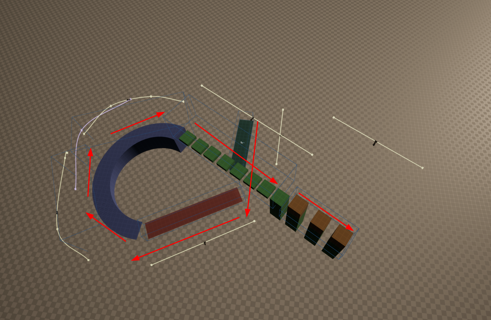

# Демонстрационная сцена камеры

> Карта `Content/Maps/Tests/L_Cameras`. Это витрина: пройди её из конца в конец,
> и каждая зона покажет одну возможность камерного рига, вывернутую достаточно
> сильно, чтобы её нельзя было не заметить. Значения здесь **демонстрационные**,
> а не рекомендуемые — в игре они обычно вдвое-втрое скромнее.
>
> Как всё устроено — `Camera.md`. Как настраивать своё — `Camera-HowTo.md`,
> раздел 4 «Рецепты: типовые камеры».

## Маршрут

Иди по зонам подряд. Порядок не случайный: каждая следующая опирается на то,
что ты уже увидел в предыдущей.

```
зелёная  →  красная  →  арка (подъём)  →  арка (спуск)  →  платформы (5, 6)
```



> Весь уровень сверху. Стрелки — направление, в котором его проходят: от
> коробок справа по площадкам вверх, потом вниз мимо красной зоны и вокруг арки.

## 1. Зелёная зона — камера не спешит

**Что видно.** Ходишь в середине кадра — камера стоит как вкопанная. Уходишь
дальше — трогается, но приезжает с опозданием, будто нехотя.

**Что это делает.**

| Ручка | Значение | Что даёт |
| --- | --- | --- |
| `Rail Damping` | 1.0 | за сколько камера съедает две трети оставшегося расстояния. По умолчанию 0.333 — здесь втрое ленивее |
| `Look At Dead Zone` | 0.15 / 0.25 | коробка в середине кадра, внутри которой камера не поворачивается вообще. В долях кадра: 0.15 — это 15% ширины |

**Что попробовать.** Поставь `Rail Damping` в 0 — камера приколется к точке на
рельсе и станет жёсткой. Обнули мёртвую зону — начнёт реагировать на каждый шаг.
Разница между 0.333 и 1.0 на глаз больше, чем кажется по числам.

## 2. Красная зона — кадр смотрит вперёд

**Что видно.** На бегу кадр уезжает вперёд по ходу движения, освобождая место
там, куда ты бежишь. Останавливаешься — возвращается к персонажу.

**Что это делает.**

| Ручка | Значение | Что даёт |
| --- | --- | --- |
| `Look Ahead Time` | 0.8 с | на сколько секунд собственного движения вперёд смотрит камера. На 400 см/с это 320 см |
| `Look Ahead Damping` | 0.2 с | сглаживание скорости. Без него разворот на месте менял бы знак за один кадр |

**Почему именно здесь.** Упреждение читается только на длинном прямом отрезке —
этот рельс 22 метра, самый длинный на карте. В короткой зоне ты не успеешь
разогнаться, и настройка будет выглядеть сломанной, хотя работает.

## 3–4. Арка — переезд идёт по дуге

Арка это **две зоны**, подъём и спуск, а не одна. Так сделано намеренно: поворот
на 167° внутри одной зоны сделал бы управление неопределённым — подробности в
`Camera-HowTo.md`, §3.

**Что видно.** На вершине арки камера перебирается с внешней стороны подъёма на
внешнюю сторону спуска — и обходит арку **снаружи**, по нарисованной дуге.

**Что это делает.**

| Ручка | Значение | Что даёт |
| --- | --- | --- |
| `Use Blend Spline` | вкл на зоне спуска | ехать по нарисованной траектории, а не по прямой |
| `Blend Spline` | дуга из трёх точек, 30 м | сама траектория. Прямая между теми же концами — 25 м, и она проходит **сквозь арку** |
| `Transition Hold Time` | 0.25 с | сколько после переключения никакая камера не может забрать кадр. Держит стык от дребезга |

**Что попробовать.** Выключи `Use Blend Spline` на зоне спуска и пройди вершину
снова: камера прошьёт арку насквозь. Это лучшая иллюстрация того, зачем эта
настройка вообще существует, — геометрия говорит сама, без объяснений.

**Что попробовать ещё.** Подними `Blend In Time` до 4 секунд, чтобы разглядеть
дугу в движении. На двух секундах она проходит слишком быстро.

## Лестница

Лестница идёт по диагонали: уклон 11,6°, ось подъёма по курсу −167,5°, пролёт
2828 см. Ни с одной мировой осью она не совпадает, и края у неё не симметричны —
713 см от осевой линии с одной стороны, 1007 с другой. Если будешь ставить рядом
что-то вдоль неё, считай от этих чисел, а не от габаритной коробки: коробка
осевая и про диагональ ничего не знает.

Ступени проходимы: меш сделан инструментами моделирования и достался без простой
коллизии, ему проставлено `Collision Complexity = Use Complex Collision As
Simple`, то есть капсула метёт по настоящим треугольникам. Добавишь на карту ещё
один такой меш и персонаж провалится — причина будет та же.

### Своей камеры у лестницы пока нет

Лестница в середине арки **не накрыта ни одной зоной**, и это сделано осознанно.
До 25 августа она попадала внутрь обеих зон арки сразу: те дотягивались от дуги
до самого центра круга. Приоритет у обеих нулевой, значит побеждала та, в
которую вошли последней, а их направления управления разведены на 98° — идя по
ступеням, игрок ловил переворот кнопок туда-обратно.

Зоны поджаты в кольцо вокруг дуги, радиус 800…1800; лестница стоит в 344 см от
центра и теперь вне обеих. Кадр на ней держит та камера, которая была последней
перед входом. Если лестница должна показывать что-то своё — ей нужен
собственный риг, и с какой стороны его ставить, решает тот, кто придумывает
кадр, а не геометрия.

## 5. Подъём по площадкам — персонаж не в середине кадра

Четырнадцать площадок одной прямой, курс −60°, подъём с 666 до 1301 по высоте.

**Что видно.** Персонаж стоит не в центре кадра, а заметно левее, и справа от
него открыто то, куда он лезет. На середине экрана он был бы спиной к пустоте.

**Что это делает.**

| Ручка | Значение | Что даёт |
| --- | --- | --- |
| `Look At Screen Offset` | 0.25 / 0 | где в кадре стоит персонаж, в долях кадра от середины. 0.25 по X — четверть кадра вбок; отрицательное — в другую сторону, Y поднимает |

**Что попробовать.** Обнули офсет и пройди подъём снова: разница в том, сколько
дороги впереди видно, а не в том, где персонаж. Поставь −0.25 — камера начнёт
показывать пройденное вместо предстоящего, и станет ясно, зачем у этой ручки
есть знак.

## 6. Верхние площадки — доворот с ограничением

**Что видно.** Камера доворачивается за персонажем, но до края не доходит: у
конца площадок она останавливается, и дальше персонаж уходит к краю кадра сам.

**Что это делает.**

| Ручка | Значение | Что даёт |
| --- | --- | --- |
| `Clamp Yaw` | вкл | ограничивать доворот по горизонтали вообще |
| `Yaw Clamp Range` | −8…8 | насколько градусов камере позволено отвернуться **от того поворота, который ты ей задал в редакторе**, а не от осей мира |

**Что попробовать.** Расширь диапазон до −45…45 — камера снова доводит персонажа
до середины. Выключи `Clamp Yaw` — ограничение исчезает совсем. Здесь диапазон
нарочно тесный: на витрине настройка должна быть заметна, в игре 8° это мало.

**Важно про отсчёт.** Клампы считаются от поворота камеры, заданного в редакторе.
Развернул камеру — развернулись и границы вместе с ней.

## Что ещё не наряжено

Всё шесть зон показывают по настройке. Из крупного не показано: пресеты
(`UOWH_CameraRigPreset`, §13 в `Camera.md`) — их смысл в том, что одни настройки
делятся между многими ригами, и на одной зоне это не показать; тряска
`Ambient Shake` — для неё нужен ассет тряски; и репетиция в редакторе (§14),
которую смотрят не в игре, а во вьюпорте.
