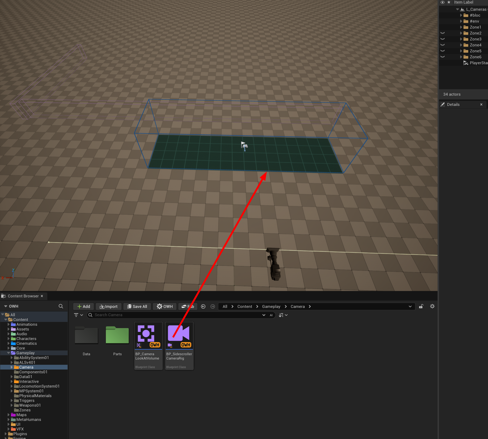
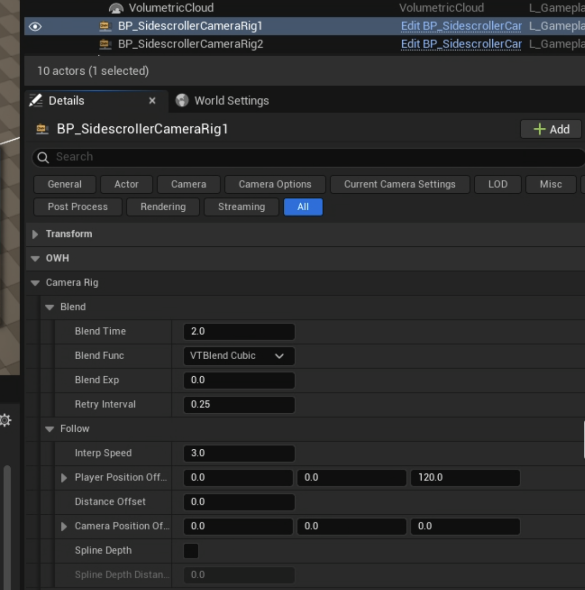
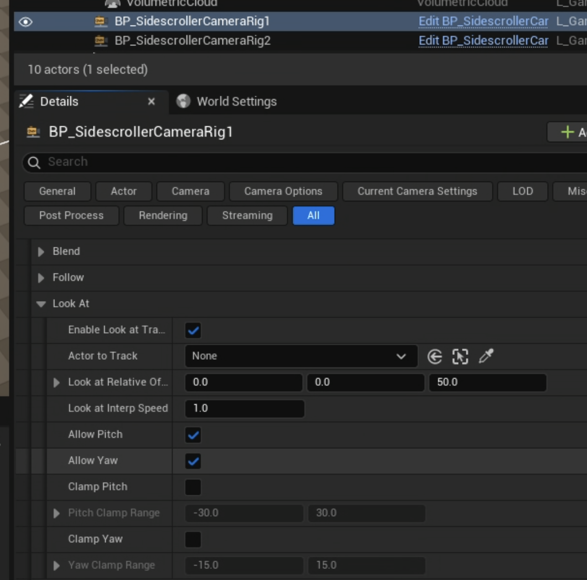
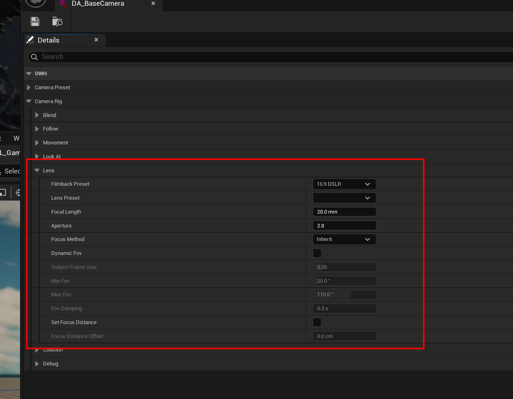
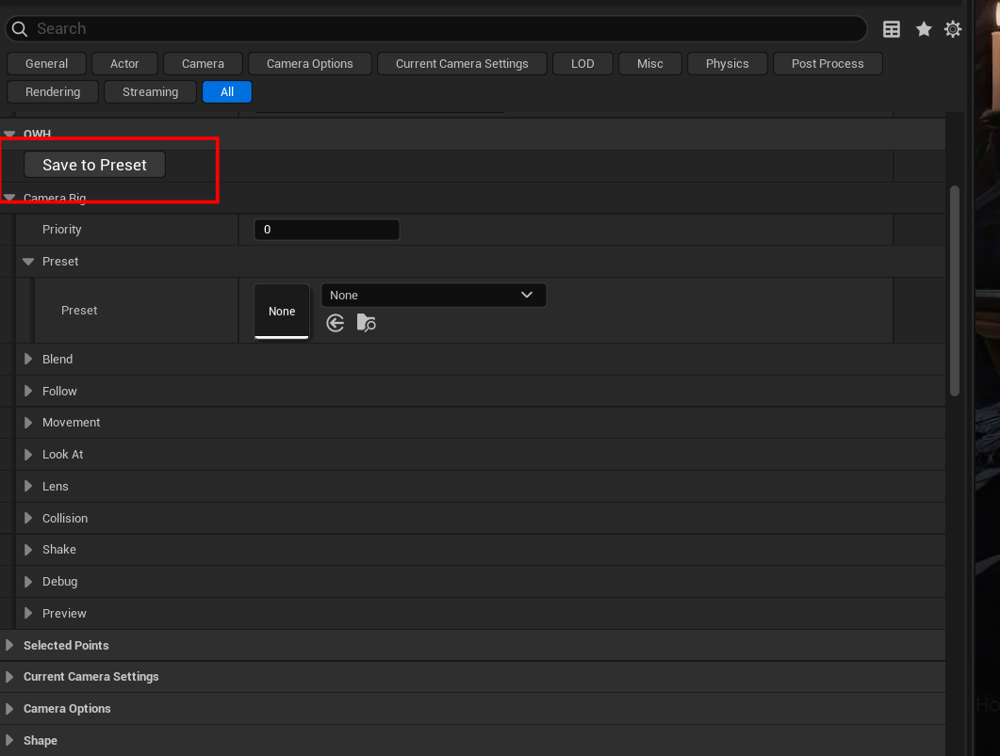

# Камера: как поставить

Короткая инструкция по `BP_SidescrollerCameraRig` — одному актору, который и
есть вся боковая камера. Подробное устройство системы — в [Camera.md](Camera.md).

---

## 1. Что взять

```
/Game/Gameplay/Camera/BP_SidescrollerCameraRig
```



В корне папки `Gameplay/Camera` лежит только то, что ставится на уровень. Всё
служебное — в `Data/`, туда лезть не нужно.

## 2. Куда поставить

1. Перетащить риг на уровень.
2. **Растянуть коробку** `Zone` по участку, где эта камера должна работать.
   По умолчанию она 16 × 4 × 4 метра (`Box Extent` 800 × 200 × 200). Высоты
   должно хватать, чтобы персонаж не вышел из зоны в прыжке.
3. **Нарисовать сплайн** `Rail` — траекторию, по которой едет камера. Выделить
   риг, выбрать компонент `Rail`, тянуть точки во вьюпорте.

Всё. Парентить ничего не надо, ссылки ни на что заполнять не надо: рельс и
камера — части самого рига.

**У рига есть значок.** В середине зоны висит билборд с иконкой камеры — по нему
риг выделяется одним кликом, не надо целиться в ребро коробки или в сплайн.
Значок не уменьшается с расстоянием и в игре не виден.

Из коробки рельс уже нарисован вдоль зоны, отодвинут на 8 метров и поднят на 2,
так что только что поставленный риг сразу даёт боковой вид. Дальше — по вкусу.

**Рельс — это где камера едет, а не куда смотрит.** Куда смотреть, она решает
сама: доворачивается на персонажа.

### Три сплайна, и который из них какой

На риге висят три сплайна. Раньше движок рисовал все три одинаковым белым, и
понять, что ты сейчас тянешь, можно было только по выделенному компоненту.
Теперь у каждого свой цвет:

| Сплайн | Что это | Когда виден |
| --- | --- | --- |
| `Rail` | **Жёлтый — где едет камера.** Тот самый, который рисуют всегда. | всегда |
| `Blend Spline` | **Фиолетовый — как камера приезжает** с предыдущей камеры. Выключен — переезд по прямой; включён — по нарисованной дуге. | при `Use Blend Spline` |
| `Preview Path` | **Зелёный — где, как ты ожидаешь, пойдёт персонаж.** В игре не используется совсем: по нему ходит болванка, когда кадр репетируют в редакторе, не запуская игру (§7). | при включённой репетиции |

Жёлтый — про камеру, зелёный — про персонажа, фиолетовый — про переход между
двумя камерами. Выделенный сплайн всё равно становится белым, так что цвет
отвечает «что это», а выделение — «что я сейчас двигаю».

Когда рядом стоят несколько ригов, игрок просто переходит из зоны в зону, и
камера переезжает. Соединять их между собой не нужно.

У каждой зоны свой рельс и своя камера. Зоны можно ставить встык или с зазором —
в зазоре останется работать та камера, которая была последней.

### Зоны внахлёст и `Priority`

Зоны можно накладывать друг на друга, в том числе класть одну внутрь другой.
Показывает та, у которой **выше `Priority`** (по умолчанию у всех 0). Выйдя из
неё, игрок сразу получает обратно ту зону, в которой всё ещё стоит, — выходить
из внешней и заходить заново не надо.

Типовой случай: длинная зона на весь коридор и маленькая зона с особым кадром у
двери внутри неё. Поставь маленькой `Priority` 1 — и всё.

При равных приоритетах побеждает та зона, в которую вошли позже. Поэтому
обычная цепочка зон работает так же, как работала всегда, и приоритеты трогать
не нужно, пока зоны не начали перекрываться.

## 3. Как настроить

Главные пять ручек, в порядке того, как часто их трогают.

| Ручка | По умолчанию | Что делает |
| --- | --- | --- |
| `Rail Damping` | 0.333 с | за сколько камера догоняет игрока вдоль рельса. Меньше — резче, больше — ленивее |
| `Blend In Time` | 2.0 | сколько секунд занимает переезд на этот риг с предыдущего |
| `Blend Out Time` | 1.0 | сколько занимает откат назад, если игрок вернулся |
| `Blend Reverse Ease` | 0.15 с | за сколько переезд разворачивается, если игрок передумал на полпути |
| `Camera Position Offset` | (0,0,0) | постоянный сдвиг камеры в мире: отодвинуть, поднять |
| `Distance Offset` | 0.0 | сдвиг вдоль сплайна. Плюс — камера идёт впереди игрока, минус — позади |
| `Look At Relative Offset` | (0,0,50) | куда целиться на персонаже. Меньше по Z — в ноги, больше — в голову |
| `Rail Follow Mode` | Proportional | как камера выбирает точку на рельсе. См. ниже |



Кадр сильнее всего задаёт не это, а объектив: сенсор, фокусное расстояние и
диафрагма. Их можно задать прямо на компоненте `Camera`, как у обычной
`CineCamera`, а можно — **в пресете**, одним набором на много камер: см. §5.

> **Скорости стали временами.** Раньше слежение задавалось «скоростью» без
> единиц: 3.0 — это ни секунды, ни проценты. Теперь то же самое — в секундах:
> сколько времени камера догоняет. Правило перевода простое — **единицу поделить
> на старое число**: было 3 → стало 0.333, было 10 → 0.1, было 1 → 1.0. Ноль
> теперь означает «мгновенно», а не «никогда». Камера при этом ведёт себя
> ровно как раньше: поменялось название, не поведение.


> *Слежение по рельсу.* Снято с только что поставленного рига, поэтому в
> картинке ровно те значения по умолчанию, о которых говорит текст.

### Камера дёргается на прыжках

`Follow Damping` — сглаживание **отдельно по осям**, в секундах. По умолчанию
`(0, 0, 0.2)`: вертикаль сглажена, горизонталь нет. Поэтому прыжок персонажа
почти не доходит до кадра, а бег отслеживается так же быстро, как раньше.

- Кадр всё ещё подпрыгивает → подними Z до 0.4–0.6.
- Хочешь, чтобы камера ходила за прыжком → поставь Z в 0.
- Все три в нуле — поведение до этой правки.


> *Куда смотрит.* Вся категория целиком: демпфирование, точка кадра, мёртвая
> зона, упреждение и клампы.

### Как быстро камера доворачивается

`Look At Yaw Damping` (1.0 с) — за сколько камера поворачивается на персонажа по
горизонтали. `Look At Pitch Damping` — то же по вертикали, но по умолчанию
работает не оно: включена галочка `Link Look At Damping`, и наклон берёт число
поворота.

Снимай связку, когда камера наклоняется слишком нервно, а панорамирует нормально
— так почти всегда и бывает. Камера, которая панорамирует бодро и наклоняется
медленно, читается как намеренная; та, что наклоняется так же бодро, — как
дёрганая.

### Мёртвая зона: камера не реагирует на мелочи

По умолчанию камера доворачивается на любое движение персонажа, даже на шаг.
`Look At Dead Zone` задаёт прямоугольник в **долях кадра**, внутри которого
персонаж двигается, а камера стоит неподвижно. Выйдя за край, камера
доворачивается ровно настолько, чтобы вернуть его **на край**, а не в середину.

**С чего начать: `0.15` по X, `0.25` по Y.** Это примерно «средняя шестая часть
кадра по ширине и четверть по высоте»: шаги и мелкие прыжки кадр не будят,
настоящее перемещение — будит.

`Look At Screen Offset` — где вообще стоит персонаж в кадре, считая от середины,
тоже в долях кадра. `0.25` по X — на четверть кадра правее центра;
положительный Y поднимает его. Ноль — середина, как было всегда. Удобно, когда
персонаж идёт вправо и нужно освободить место впереди него.

Обе настройки нулевые из коробки — включай осознанно, они меняют композицию.

Обе можно не набирать числами, а **вытащить мышью прямо на картинке
предпросмотра** — см. §7.

### Камера не ползает, пока персонаж топчется

Мёртвая зона держит **поворот**. Положение камеры она не держит: персонаж
переступает на месте — камера едет за ним по рельсу на пару сантиметров туда и
обратно, и кадр всё время слегка дышит.

`Follow Dwell Radius` — сфера в сантиметрах вокруг той точки, которую камера уже
приняла за место персонажа. Пока он внутри — камера не двигается вообще. Вышел —
центр сферы отпускается **на её край**, а не прыгает к персонажу, поэтому
движение начинается плавно, а не рывком.

**С чего начать: 60–120.** Меньше половины шага — незаметно; больше метра —
камера начнёт запаздывать на настоящем перемещении. Ноль (из коробки) —
выключено, поведение ровно прежнее.

### У персонажа есть размер

Из коробки камера считает персонажа **точкой**. Мёртвая зона и точка кадра
меряются от его начала координат, поэтому подошедший вплотную персонаж держит
свой центр послушно в середине кадра, а головой выходит за верхний край.

`Frame Subject Volume` — включи, и мёртвая зона начнёт мерить его **целиком**:
внутрь коробки должен помещаться он весь, а не его центр. Правило то же самое,
просто зона становится уже на его собственную ширину. Персонаж шире зоны
центрируется — уместить его иначе нельзя.

**Выключено по умолчанию, и намеренно:** оно делает любую уже настроенную
мёртвую зону теснее, а уже принятый кадр не должен меняться от того, что
появилась возможность.

### Целиться в кость, а не в актора

`Look At Targets` — список субъектов кадра. Пустой список значит «то, на что риг
и так смотрел»: look-at вольюм, `Actor To Track` или персонаж, с размером по его
собственным баундам. Заполнять его нужно, когда надо сказать то, чего прежним
субъектом сказать было нельзя.

У цели есть:

| Поле | Что делает |
| --- | --- |
| `Actor` | на кого смотреть; пусто — обычный субъект рига |
| `Component` | какой компонент на нём; пусто — корень |
| `Bone` | кость или сокет — так кадр наводится на лицо, а не на середину тела |
| `Auto Size` | взять размер из баундов |
| `Radius` | задать размер руками, когда баунды врут |
| `Offset` | сдвинуть субъекта; `Offset In Local Space` — в его собственных осях |
| `Weight` | сколько он весит, когда субъектов несколько |

**У кости размер всегда задаётся руками.** Спросить баунды у скелетал-меша,
целясь в голову, — значит получить всего персонажа с раскинутыми руками, а кадр
про голову не должен расширяться от того, что он поднял руку.

**Несколько субъектов** складываются в одну коробку: она содержит всех, а
середина кадра стоит там, куда её ставят веса. Двое с весами 1 и 3 дают середину
на четверти пути от второго к первому.

### Камера сама подбирает объектив

`Dynamic Fov` — камера меняет объектив так, чтобы субъект занимал одну и ту же
долю кадра, как далеко бы он ни был.

| Параметр | Что делает |
| --- | --- |
| `Subject Frame Size` | какую долю кадра он занимает; 1 — во весь кадр, 0.35 — треть |
| `Min Fov` | самый длинный объектив, куда камера может зайти |
| `Max Fov` | самый широкий |
| `Fov Damping` | за сколько секунд зум успокаивается; ноль читается как рывок |

Считается по обеим осям сразу, и побеждает та, что шире: стоящий персонаж узкий
и высокий, и объектив, подобранный по его плечам, срезал бы ему голову.

Работает только вместе с `Frame Subject Volume` — без размера субъекта называть
нечего.

### Фокус на персонаже

`Set Focus Distance` — камера ставит дистанцию фокуса на субъекта,
`Focus Distance Offset` смещает её ближе или дальше.

Это то, ради чего можно наконец включать глубину резкости: CineCamera из коробки
фокусируется вручную на километре, и на любой реальной диафрагме размазывает
всё. Результат видно прямо в картинке предпросмотра.

### Камера не въезжает в стену

`Camera Collision` — камера проверяет, свободно ли место, куда её послал рельс.
Упёршись в геометрию, она поджимается к персонажу и показывает кадр, а не изнанку
уровня.

Выключено по умолчанию, и выключенное **не стоит ничего**: никакой проверки не
происходит вовсе, кадр возвращается ровно тем, каким его дал рельс. Рельсу,
который дизайнер провёл сам, это чаще всего и не нужно — в стену камеру уводят
`Camera Position Offset`, `Distance Offset` и look-at вольюм, то есть три вещи,
двигающие её с нарисованной линии.

| Параметр | Что делает |
| --- | --- |
| `Collision Probe Radius` | радиус шарика, которым щупается место; мал — объектив срежет угол, который центр шарика прошёл чисто |
| `Collision Min Distance` | ближе этого к персонажу камера не подойдёт никогда |
| `Collision Max Pull In` | больше этого кадра камера не отдаст; ноль — предела нет |
| `Collision Restore Time` | за сколько секунд камера уезжает обратно, когда стены не стало |
| `Collision Fov Curve` | необязательная: насколько расширить объектив при поджатии |

**Два предела, и побеждает больший.** «Не терять больше трёх метров» — это про
кадр, «не ближе шестидесяти сантиметров» — про персонажа. Это разные требования
к одному числу, и держатся оба. Камеру, поставленную ближе `Collision Min
Distance`, эта настройка **не** отодвигает: пол существует, чтобы не вдавливать
камеру в персонажа, а не чтобы двигать кадр, который выстроили руками.

**Внутрь — мгновенно, наружу — за время.** У `Collision Restore Time` нет пары
для дороги внутрь, и это сделано нарочно: стена появляется между двумя кадрами,
и камера, въезжающая в ответ за треть секунды, — это камера, треть секунды
стоящая в стене.

`Collision Fov Curve` рисуется прямо в панели деталей, ассет для неё заводить не
надо. По горизонтали — сколько кадра отдано, от 0 до 1, где 1 значит «камера
стоит на `Collision Min Distance`»; по вертикали — сколько градусов прибавить к
объективу. Кривая, в которой никто не нарисовал ни одной точки, не делает
ничего. Разумное начало — прямая от (0, 0) до (1, 25).

### Камера смотрит вперёд по ходу бега

`Look Ahead Time` — на сколько секунд движения персонажа камера смотрит вперёд.
При `0.4` бегущий 400 см/с кадрируется так, будто он уже на 160 см дальше.
Ноль — выключено.

`Look Ahead Damping` (0.2 с) — сглаживание скорости. Если при развороте на месте
кадр швыряет, увеличь.

Упреждение видно и в репетиции в редакторе, но только при включённом
автопрогоне: скраббер, который тащат рукой, — это не движение.


> *Переезд.* `Blend Reverse Ease` стоит между временем туда и временем обратно,
> потому что это третье время того же движения. `Transition Hold Time` —
> последняя строка.

### Камера трясётся на границе двух зон

`Transition Hold Time` (0.25 с) — сколько после переключения никакая камера не
может забрать кадр снова. Если игрок стоит ровно на стыке и картинка дрожит,
увеличь до 0.5.

Откату это не мешает: шаг назад в только что покинутый вольюм по-прежнему
разворачивает камеру немедленно.

### Ограничить доворот

- `Allow Pitch` / `Allow Yaw` — выключенная ось замирает **там, куда камера
  смотрит в редакторе**. Наведи её так, как нужно, любым способом: поверни
  компонент `Camera` или поверни весь риг — что удобнее.
  Кадр, который ты видишь во вьюпорте, и есть тот, который замрёт.
- `Clamp Pitch` + `Pitch Clamp Range`, `Clamp Yaw` + `Yaw Clamp Range` —
  диапазоны в градусах **от того же поворота камеры**, а не от осей мира. По
  умолчанию −30…30 и −15…15.
- Крен (`Roll`), если ты его задал, сохраняется: наклонённый кадр — это решение,
  и риг его не выпрямляет.

### Как камера идёт по рельсу

`Rail Follow Mode`:

- **`Proportional`** (по умолчанию) — рельс делится поровну на путь игрока через
  зону. Камера проходит рельс целиком, от начала до конца, в том порядке, в
  котором он нарисован. Кривой рельс с этим режимом безопасен.
- **`Closest Point`** — камера встаёт в геометрически ближайшую к игроку точку.
  Так работала система раньше. На изгибе ближайшая точка может оказаться совсем
  на другом участке рельса, поэтому скорость хода ограничена
  `Max Rail Travel Speed` (1500 см/с): вместо прыжка камера доезжает.

**Рельс можно вести вверх.** Для секции лазания нарисуй рельс вертикально — и
камера поедет вместе с персонажем: рельс, который поднимается больше, чем идёт
вбок, меряется по подъёму. Ничего включать не надо.

На обычном горизонтальном рельсе высота по-прежнему не считается, поэтому прыжок
камеру вдоль рельса не двигает.

### Переезд между камерами

- `Blend In Time` — переезд сюда с предыдущей камеры.
- `Blend Out Time` — тот же путь назад. Он нужен, потому что **если игрок
  развернулся и ушёл обратно, пока камера ещё едет, она возвращается по той же
  траектории** и отдаёт кадр предыдущей камере ровно там, откуда взяла. Раньше
  она в этот момент дёргалась в новую позицию и оставалась стоять. По умолчанию
  назад быстрее: возврат — это исправление, и если он длится столько же, сколько
  сам переезд, кажется, что камера спорит.
- `Blend Reverse Ease` — за сколько секунд переезд **разворачивается**, если
  игрок передумал на полпути. Ноль означает мгновенный разворот, и это заметно:
  выходя из зоны камера обычно опускается, поэтому мгновенный разворот
  подбрасывает кадр вверх. 0.15 с гасит толчок и на глаз не удлиняет возврат.
- `Blend Curve` — форма кривой: `Linear`, `Cubic`, `EaseIn`, `EaseOut`,
  `EaseInOut`. `Blend Exp` — показатель степени для трёх последних.
- `Use Blend Spline` — ехать не по прямой, а по нарисованной траектории.
  Включаешь галочку → в редакторе появляется сплайн `Blend Spline`, рисуешь его.
  Выключаешь → сплайн пропадает и переезд снова прямой.

**Сплайн бленда можно включить до того, как его нарисовали.** Из коробки он
прямой, а прямой сплайн даёт ровно тот же переезд, что и его отсутствие: форма
натягивается на две точки, между которыми едет камера, поэтому оба конца всегда
попадают точно.

**Выгнутый сплайн больше не теряет персонажа.** Раньше камера ехала по кривой, а
целилась так, будто едет по прямой, и на сильном изгибе персонаж уезжал из кадра
вверх или вниз. Теперь через переезд протаскивается сама точка, в которую
камера смотрит, поэтому кадр держится на персонаже при любой форме сплайна.

**Композиция переезжает вместе с картинкой.** Точка кадра, мёртвая зона,
демпфирование и клампы — это не свойства двух отдельных камер, которые
складываются в конце: они интерполируются той же кривой, что и сам переезд. Если
у одной камеры персонаж стоит на четверть кадра правее, а у другой посередине —
он **переходит** из одного места кадра в другое, пока идёт переезд, а не
перескакивает в конце. Настраивать для этого нечего, это просто происходит.

#### Разный переезд с разных сторон

Время, кривая и hold лежат на риге, **на который** переходим, то есть вход в
зону одинаков, откуда бы ты в неё ни пришёл. Из коридора и с балкона — это,
вообще-то, разные монтажные события.

Чтобы их развести, есть таблица переездов — один ассет на всю игру:

1. Дай каждой камере имя: поле `Camera Tag` на риге, в категории `Blend`. Теги
   заводятся прямо из выпадашки, кнопкой внизу списка.
2. Создай ассет **OWH Camera Blend List** (правый клик в Content Browser →
   Miscellaneous → Data Asset, класс `OWH Camera Blend List`).
3. Пропиши его в **Project Settings → Game → OWH Camera → Camera Blend List**.

В ассете один список правил. У правила два тега — `From Camera` и `To Camera` —
и настройки переезда: `Blend Time`, `Reverse Time` (назад; ноль — столько же,
сколько туда), `Hold Time`, `Curve`, `Exponent`.

Три правила, которые надо понять, и больше в этой таблице ничего нет:

- **Правила читаются сверху вниз, побеждает первое подошедшее.** Частные —
  выше, общие — ниже.
- **Пустой тег значит «любая камера».** Правило с пустым `To Camera` — это «от
  этой камеры куда угодно»; с обоими пустыми — «вообще всё», и такому место в
  самом низу.
- **Названный тег ловит и своих детей.** `Camera.Corridor` подойдёт и
  `Camera.Corridor.Narrow`, так что одной строкой описывается целое семейство.

Пример: первой строкой «из коридора в арену — 2 секунды», второй «с балкона куда
угодно — 0» (то есть срез), третьей «в арену откуда угодно — 1.5».

**Чего в таблице нет, то решает сам риг.** Пары, которую ты не описал, таблица
не касается: у неё остаются собственные `Blend In Time`, кривая и hold. Пустая
таблица или не назначенный ассет не меняют вообще ничего.

### Куда поедет персонаж, когда ты жмёшь «вперёд»

`Stabilize Movement Basis` (включён) — пока кадр держит риг, «вправо» для
персонажа означает **«вдоль зоны»**, а не «вправо относительно камеры».
Направление задаёт коробка `Zone`: как бы ты ни нарисовал рельс внутри неё,
«вперёд» в зоне одно и то же. Повернуть управление — повернуть коробку.

Это важно на клавиатуре. На стике доступен любой угол, и управление от камеры
было бы честным; на клавиатуре направлений восемь, и если коридор не параллелен
экрану, вдоль стены просто не пробежать — персонаж пойдёт в неё под углом. Ось
зоны эту проблему снимает: кнопка «вправо» ведёт вдоль коридора, а не вдоль
экрана.

**Смена направления происходит в конце переезда, а не в начале.** Когда игрок
переходит в соседнюю зону, управление ещё некоторое время читается по старой
зоне и переключается на новую, только когда камера доехала. Иначе управление
менялось бы поверх едущей картинки — две подвижные вещи сразу, и ощущение, что
кнопки вырывают из рук. На вставшем кадре то же переключение проходит незаметно.

Выключи галочку, если в этой зоне нужно управление ровно по камере — см. рецепт
«за спиной» ниже.

#### У коробки есть направление, и это её длинная сторона по X

Риг читает направление управления из **локального X зоны**, и рельс из коробки
рисуется вдоль той же оси. То есть зона — это коридор, смотрящий вдоль X, и
`Box Extent` по X обязан быть самым большим из трёх.

Коробка, вытянутая по Y, — не «повёрнутая зона», а зона, у которой **всё
производное от оси развёрнуто на четверть оборота**: управление идёт поперёк
дорожки, а знак базиса решается величиной, которая почти ноль.

Проверяется по числам, не на глаз: открой `Zone`, посмотри `Box Extent`. Если
X не самый большой — коробку надо повернуть на 90° и поменять X с Y местами, а
не подвинуть.

Так это выглядело на демонстрационной карте: две зоны стояли с `Box Extent`
(400, 1500, 400) и (300, 700, 200) — длинная сторона по Y. Управление в них шло
поперёк платформ, камера оказывалась в полуградусе от осевой линии, и одна из
зон накрывала две площадки из семи. После разворота — 93% и 100% поперёк оси
вместо 0,7% и 5,5%.

#### Камера вдоль зоны: ось перестаёт отвечать, и это правильно

Направлений вдоль оси два, и какое из них станет «вправо», решается тем, с какой
стороны от оси стоит камера. Если камера смотрит **вдоль** зоны — стоит за спиной
персонажа или, наоборот, лицом к нему, — сторон нет, и ось не может сказать, где
на экране «вправо».

**Риг теперь это видит и отдаёт управление самой камере.** Чем сильнее она
повёрнута к оси, тем больше базис берётся от её собственного взгляда, и переход
идёт полосой, а не порогом: щелчка на девяносто градусов посреди зоны не бывает.
Камера сбоку работает ровно как раньше, до последнего знака.

Практически это значит, что вид от третьего лица и вид в лицо персонажу теперь
просто работают, и `Stabilize Movement Basis` для них выключать не нужно.

Раньше на этом месте была расплата: у рига арки на демонстрационной карте камера
стояла в **0,56° от осевой линии** при удалении двенадцать метров, знак решался
шумом, и управление переворачивалось от любого прикосновения к зоне. Найти
причину на глаз было нельзя — геометрия выглядела правильной.

Совет всё равно остаётся, но уже как совет по кадру, а не как обход дефекта:
камера сбоку от зоны даёт самое устойчивое управление, а **квадратная в плане
зона** плоха тем, что у неё нет длинной оси, и «вдоль коридора» назначается
произвольно. Зона под коридор должна быть вытянутой.

### Смотреть не на игрока

`Actor To Track` — если оставить пустым, камера следит за персонажем. Если
выбрать объект, будет смотреть на него.



## 4. Рецепты: типовые камеры

Пять кадров, которые нужны чаще всего. Всё, что не названо, оставь по умолчанию.

### Сбоку — то, что даёт свежепоставленный риг

Ничего настраивать не надо. Рельс уже нарисован вдоль зоны, отодвинут на 8
метров и поднят на 2. Растяни `Zone` по участку, при желании подвинь точки
рельса — готово.

### За спиной, вглубь коридора

Коридор уходит от зрителя, камера идёт за персонажем.

1. Рельс — **вдоль коридора**, на высоте головы, а не в двух метрах над ней.
2. **Продли рельс назад за вход в коридор** на 4–6 метров. Без хвоста камера
   упрётся в начало рельса и снова окажется сверху: сдвиг вдоль сплайна
   зажимается его длиной.
3. `Distance Offset` — **минус 400…600**. Это и есть отставание: камера
   съезжает назад по рельсу и начинает тащиться за персонажем.
4. `Rail Follow Mode` → **`Closest Point`**. `Proportional` растягивает проезд
   камеры на всю длину рельса за время пересечения зоны, то есть камера идёт по
   своему графику, а не догоняет. Скорость догона ограничивает
   `Max Rail Travel Speed`.
5. `Look At Relative Offset` по Z вверх — целиться в затылок, иначе кадр смотрит
   в пол.
6. **`Stabilize Movement Basis` → выкл.** Стабилизатор ставит «вправо» вдоль
   длинной оси зоны, а здесь эта ось уходит от камеры вглубь — то есть «вправо»
   стало бы «вперёд по коридору». Кадру за спиной нужно обычное управление от
   камеры: «вперёд» — от зрителя.

### Сверху

1. Рельс — над дорожкой персонажа, на нужной высоте.
2. `Distance Offset` = 0, чтобы камера шла ровно над ним.
3. `Look At Relative Offset` можно оставить как есть: камера и так смотрит вниз.

Это ровно то, что получается само, если провести рельс над центром коридора, —
частая случайность, когда хотели кадр за спиной.

### Статичный кадр

Камера стоит на месте и только доворачивается за персонажем.

1. Поставь **обе точки рельса в одно место** — там, где должна стоять камера.
   Ехать некуда, значит камера не едет.
2. `Rail Damping` роли не играет.

### Кадр, который не шевелится вообще

Как статичный, плюс `Enable Look At Tracking` → **выкл**. Камера держит тот
поворот, который ты ей задал, и не следит ни за кем. Для кадра «в дверном
проёме» или подсмотренной сцены.

---

## 5. Пресет: одни настройки на много камер

`Preset` — ссылка на дата-ассет `DA_…` с полным набором настроек камеры.
Заводится как обычный ассет: **Content Browser → Miscellaneous → Data Asset →
OWH Camera Rig Preset**. Класть в `Gameplay/Camera/Data/` — в корне папки лежит
только то, что ставится на уровень.

Правило простое:

- **Числа складываются.** Значение на риге прибавляется к значению из пресета.
- **Галочки трёхпозиционные**: `Наследовать` — как в пресете, `Вкл` и `Выкл`
  перебивают его. То же у списков `Rail Follow Mode` и `Blend Curve`.
- **Без пресета всё читается как есть.** Риг, которому пресет не назначали,
  работает ровно так, как работал раньше.

**Когда назначаешь пресет, числа на риге обнуляются, а галочки встают в
«Наследовать».** Это сделано нарочно: иначе к пресету молча прибавились бы
значения по умолчанию (`Interp Speed` 3, смещение 120 вверх), и риг не был бы
похож на пресет. После назначения риг **и есть** пресет, а всё, что ты потом
крутишь, — осознанная разница с ним. Если это было не то, что нужно, — Ctrl+Z.

`Actor To Track` в пресет не входит: на что смотрит конкретная камера — факт про
одно место на одном уровне, а не общий стиль.

### Объектив в пресете

Сенсор и линза живут там же, в группе `Lens`. Раньше их задавали на каждой
камере по отдельности, и пресет держал всё, кроме собственно кадра.

| Ручка | По умолчанию | Что делает |
| --- | --- | --- |
| `Filmback Preset` | `16:9 DSLR` | сенсор, на который снимается кадр. Выбирается из списка, который ведёт Project Settings |
| `Lens Preset` | пусто | линза из того же списка: задаёт диапазон фокусных и самую открытую диафрагму разом |
| `Focal Length` | 28.0 мм | 18 — широко, 85 — длинно. На сенсоре 16:9 DSLR 28 мм дают 65° по горизонтали |
| `Aperture` | 2.8 | 1.4 — размывает фон, 16 — держит всё резким |
| `Focus Method` | Наследовать | как камера фокусируется вообще |



> *Группа `Lens` в `DA_BaseCamera`.* Первые пять строк — объектив, остальные —
> динамический FOV и фокус, они были и раньше.

**Пусто, ноль и «Наследовать» ничего не трогают.** Оставь `Filmback Preset`
пустым, `Focal Length` нулём — и камера останется с той линзой, которую ей
поставили руками. Поэтому пресет можно назначить старому ригу, не испортив ему
кадр.

Порядок применения: сенсор → линза-пресет → фокусное → диафрагма → метод
фокуса. Число, написанное руками, перебивает линзу, которую принёс `Lens Preset`.

Диафрагма покажется в картинке только когда что-то задаст дистанцию фокуса —
включи `Set Focus Distance` в группе `Lens`. Без этого `CineCamera`
сфокусирована на километре и размажет весь кадр, поэтому `Focus Method` по
умолчанию стоит в «Наследовать».

### Сохранить настройки рига в пресет

Крутить настройки удобнее на самом риге: там видно кадр. Когда получилось —
кнопка **Save to Preset** в блоке `OWH` панели Details: она откроет обычный
диалог сохранения, спросит место, и запишет туда новый `DA_…` с теми
значениями, которые сейчас в кадре.



> *Кнопка живёт наверху блока `OWH`, над `Camera Rig`.*

Кнопка **только сохраняет**. Риг остаётся с тем пресетом, который у него был:
назначить новый — отдельное действие, и оно обнуляет собственные числа рига,
чтобы кадр пережил передачу. Обычный порядок: покрутил → сохранил → назначил.

## 6. Смотреть на предмет в определённом месте

`BP_CameraLookAtVolume` из той же папки `Gameplay/Camera` — отдельная коробка,
которую ставят **на предмет**. Пока игрок внутри неё, камера смотрит на этот
предмет, а не на персонажа; вышел — всё возвращается.

1. Перетащить вольюм на уровень, растянуть по участку, где камера должна
   отвлечься.
2. В поле `Target` выбрать предмет.
3. Всё. `Captured Target Location` заполнится само.

**Про выгрузку.** `Target` — мягкая ссылка, и World Partition может выгрузить
предмет. Поэтому вольюм хранит ещё и точку, где предмет стоял в момент
назначения. Предмет загружен — камера следит за ним, и он может двигаться;
выгружен — камера смотрит в запомненную точку, а это и есть то место, где он
находится, раз он не симулируется. От level-дизайна ничего не требуется: ни
держать предмет вечно загруженным, ни заводить под него слой.

Вольюмы можно накладывать друг на друга: работает тот, в который вошли
последним, а на выходе из него — тот, что под ним.

## 7. Панель камер и предпросмотр

**Window → OWH Cameras.**

- Слева — список всех ригов на уровне. Выбор в списке переключает панель на эту
  камеру; кнопка **Select In Level** выделяет её актор.
- Сверху — картинка того, что камера видит.
- **Preview** включает репетицию: на риге появляется сплайн `Preview
  Path` — путь, по которому пойдёт персонаж, — и болванка на нём.
- **Along Spline** — крутилка от 0 до длины этого пути. Крутишь — болванка
  едет, камера отрабатывает её движение со всеми своими настройками.
- **Auto Play** гоняет болванку сам, со скоростью из соседнего поля (см/с),
  по кругу — чтобы смотреть на движение, а не позировать его. **Скорость можно
  задать отрицательной** — тогда болванка идёт по пути в обратную сторону, и
  видно, каким будет кадр на обратном ходу. На обоих концах пути прогон
  заворачивается.
- **Pilot In Viewport** отдаёт камере весь вьюпорт редактора.
  Картинка в панели маленькая; судить кадр по-настоящему надо во вьюпорте.
- **Volume Bounds** рисует в игре коробку зоны и активный look-at-вольюм с
  точкой, в которую он целится. Точка зелёная, если предмет загружен, и
  оранжевая, если камера смотрит в запомненное место.

Репетиция ничего на риге не двигает: кадр вычисляется, снимается и все
трансформы возвращаются на место, поэтому уровень от неё не становится
изменённым. Крутилка, автопрогон и скорость не сохраняются — это отладка, а не
настройка.

**Болванку видно.** Серый цилиндр ростом с персонажа стоит на зелёном пути и
попадает в картинку предпросмотра — по нему и понятно, как камера видит
персонажа.

**Картинка — это то, чем камера действительно снимает.** В неё идут все
настройки CineCamera: filmback, фокусное, соотношение сторон, post process. Взял
анаморфный filmback — картинка стала широкой; включил глубину резкости — в
картинке видно размытие.

### Композиция прямо на кадре

Поверх картинки нарисованы три вещи:

- **Трети** — бледная сетка, к которой удобно прикладывать кадр.
- **Зелёный крестик** — `Look At Screen Offset`, точка, где стоит персонаж.
  Тащишь крестик — двигается точка.
- **Жёлтая рамка** — `Look At Dead Zone`. Тащишь уголок рамки — меняется размер;
  рамка всегда симметрична вокруг крестика.

Если мёртвой зоны ещё нет и рамки не видно, **зажми Shift и тяни** от любого
места картинки — зона вытянется. Каждое перетаскивание — одна отмена по Ctrl+Z,
а числа в Details меняются на ходу.

### Вьюпорт возвращают целиком

«Смотреть камерой во вьюпорте» — это **не** пилотирование актора. Вьюпорт просто
показывает то, что видит камера:

- **Вольюм при этом не двигается.** Забыл выключить и полетел по уровню — риг
  останется на месте, а вид сам вернётся к камере.
- **Release Viewport возвращает всё**, что было до входа: положение, поворот
  и FOV. Второй раз заходить и выключать пилота уже не надо.
- Закрытие панели или выбор другой камеры в списке отпускают вьюпорт сами.

**Предпросмотр — один выключатель.** Галка в панели и галка в Details рига — одно
и то же состояние, и закрытие панели снимает репетицию с уровня. Раньше
апаратура оставалась стоять при снятой галке.

## 8. Тряска

`Ambient Shake` — класс `CameraShake`, который играет, пока кадр держит эта
камера, и останавливается на выходе. `Ambient Shake Scale` — сила. Пусто —
ничего не играет.

## 9. Если что-то не так

| Симптом | Куда смотреть |
| --- | --- |
| Управление не совпадает с картинкой | проверь `Box Extent` зоны: X должен быть самым большим. Камера вдоль зоны отдаёт базис сама, ось тут ни при чём — см. §3 |
| Камера дышит, пока персонаж стоит на месте | `Follow Dwell Radius` — начать с 60–120 |
| Персонаж вплотную выходит головой из кадра | `Frame Subject Volume` — включить |
| Камера кадрирует не то место персонажа | `Look At Targets`, цель с нужной костью и радиусом |
| Динамический объектив уходит в телевик | `Subject Frame Size` мал; и он ничего не делает без `Frame Subject Volume` |
| Глубина резкости размазывает весь кадр | `Set Focus Distance` — включить |
| Камера показывает изнанку уровня у стены | `Camera Collision` — включить |
| Камера у стены прыгает персонажу в затылок | `Collision Min Distance` — поднять, или `Collision Max Pull In` — ограничить |
| Камера возвращается от стены рывком | `Collision Restore Time` — увеличить |
| Камера не переключилась | коробка `Zone` не накрывает то место, где идёт игрок |
| Камера дёргается за игроком | `Rail Damping` — увеличить |
| Камера отстаёт | `Rail Damping` — уменьшить |
| Кадр подпрыгивает вместе с персонажем | `Follow Damping`, поднять Z |
| Камера реагирует на каждый шаг | `Look At Dead Zone` — начать с 0.15 / 0.25 |
| Камера тащится за бегом, а не ведёт его | `Look Ahead Time` — 0.3…0.5 |
| Кадр швыряет при развороте на месте | `Look Ahead Damping` — увеличить |
| Картинка дрожит на стыке двух зон | `Transition Hold Time` — увеличить до 0.5 |
| Наклон камеры нервный, поворот нормальный | снять `Link Look At Damping`, поднять `Look At Pitch Damping` |
| Персонаж стоит в кадре не там | `Look At Screen Offset` — доли кадра от середины |
| Камера стала вялой после обновления | скорости заменены временами: единицу поделить на старое число, было 3 → 0.333 |
| Из двух наложенных зон показывает не ту | `Priority` — поднять у той, которая должна побеждать |
| Вышел из маленькой зоны, кадр не вернулся | большая зона не накрывает это место: камера знает только те зоны, в которых игрок реально стоит |
| Камера смотрит в ноги | `Look At Relative Offset`, поднять Z |
| Камера слишком близко или далеко | `Camera Position Offset`, либо сдвинуть сам рельс |
| Переход слишком резкий или слишком долгий | `Blend In Time` на риге, **на который** переходим |
| Переход должен быть разным с разных сторон | таблица переездов: `Camera Tag` на ригах и ассет `OWH Camera Blend List` — см. §3 |
| Правило в таблице не срабатывает | выше него стоит более общее правило: первое подошедшее побеждает |
| Персонаж уезжает из кадра на выгнутом сплайне бленда | этого больше не бывает; если видно — проверь, что риг пересобран |
| Возврат назад слишком медленный | `Blend Out Time` на том же риге |
| Кадр подбрасывает вверх, когда передумал и вернулся | `Blend Reverse Ease` стоит в нуле — поставить 0.15 |
| Кадр щёлкает в момент, когда возврат доехал | этого больше не бывает; если видно — проверь, что риг пересобран |
| Объектив в пресете не действует | значения нулевые или пустые: ноль и пустая строка означают «не трогать камеру» |
| Камера едет по прямой сквозь стену | включить `Use Blend Spline` и обвести стену |
| Все камеры надо поправить одинаково | завести пресет и назначить его им всем |
| Камера смотрит не на тот предмет | вольюм look-at перебивает `Actor To Track`; проверить, не стоит ли игрок в нём |
| Кадр не тот, что в редакторе | камера доворачивается на персонажа в игре; в редакторе она стоит как поставлена. Выключи `Allow Yaw` / `Allow Pitch`, и она останется ровно в редакторном кадре |
| Не найти риг на уровне | кликни по билборду в середине зоны |
| Вьюпорт остался с настройками камеры | нажми **Release Viewport**; этого больше не должно случаться |
| Камера перескочила через кусок рельса | `Rail Follow Mode` стоит в `Closest Point` — переключить на `Proportional`, либо уменьшить `Max Rail Travel Speed` |
| Персонаж бежит по диагонали | `Stabilize Movement Basis` на риге — включить |
| Непонятно, куда она вообще целится | включить `Debug Draw`: сфера на игроке, сфера на рельсе, линия между ними |

Пока камерой владеет катсцена, риг вид не забирает, но и не забывает: он
повторяет попытку каждые `Retry Interval` секунд, пока игрок стоит в зоне, и
берёт кадр, как только катсцена закончится. Если за это время игрок дошёл до следующего рига, вид достаётся
тому — назад никто не отнимает.

---

**Можно и по отдельности.** Рельс, камера и переключатель существуют как три
самостоятельных актора — так собраны старые уровни, и так по-прежнему можно
собирать, если нужен случай, которого риг не покрывает: например одна камера,
последовательно идущая по цепочке рельсов. Схема требует руками припарентить
камеру к рельсу и заполнить поле `To` на переключателе, и целиком описана в
длинной документации — [Camera.md](Camera.md).

Обе схемы работают на одной карте одновременно и передают вид друг другу.
