# Камера и рельсы

Как устроена боковая камера One Way Home: из чего система собрана, что дизайнер
ставит на уровень, какие параметры на чём крутятся и что происходит в момент
перехода с одной камеры на другую.

Документ описывает систему **как она работает сегодня**. Всё, что расходится с
задумкой, вынесено в раздел «Расхождения» в конце и не размазано по тексту.

Замер: 2026-08-18, ветка `develop`. Комплексный риг добавлен 2026-08-19,
переработан 2026-08-21: авторский кадр, равномерный проход рельса, базис
движения персонажа, собственный бленд, пресеты, вольюм look-at и панель камер.

> Нужно просто поставить камеру на уровень — короткая инструкция лежит
> отдельно: [Camera-HowTo.md](Camera-HowTo.md).

---

## 1. Коротко

Камера в игре не висит за спиной персонажа. Она едет по **рельсу** — сплайну,
который дизайнер рисует на уровне, — и всегда стоит в той точке рельса, которая
ближе всего к игроку. Куда смотреть, камера решает сама: движковый механизм
слежения (look-at tracking) доворачивает её на персонажа.

Какой рельс сейчас активен, решают **вольюмы-переключатели**: игрок входит в
коробку, коробка говорит «теперь работает вот этот рельс», камера переезжает.

Вся логика живёт в одном компоненте на персонаже. Всё остальное — объекты,
которые расставляет дизайнер, и данные на них.

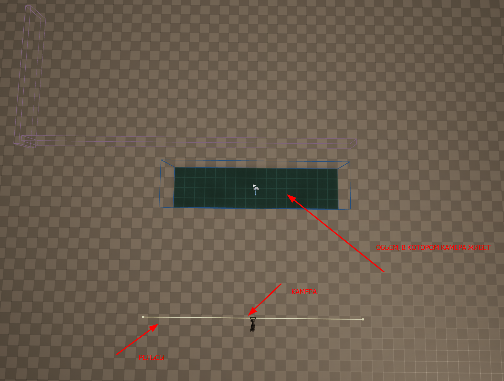

> **Иллюстрация 1.** Вид сверху: синяя коробка — зона, в которой этот риг
> держит кадр; жёлтая линия под ней — рельс, по которому едет камера; сама
> камера стоит на его середине.

---

## 2. Из чего система состоит

| Объект | Что это | Где лежит |
| --- | --- | --- |
| `BP_SidescrollerCameraRig` | весь риг одним актором, для новых уровней | `Gameplay/Camera/` |
| `AC_SidescrollerCameraConnector` | компонент на персонаже, вся логика | `Gameplay/Components01/` |
| `BP_SidescrollerCameraRails` | рельс: сплайн + настройки | `Gameplay/Camera/` |
| `BP_SidescrollerCamera` | камера, которая едет по рельсу | `Gameplay/Camera/` |
| `BP_SidescrollerCameraSwitcher` | вольюм «включить этот рельс» | `Gameplay/Camera/` |
| `BPFL_SidescrollerCameraHelpers` | одна функция: навести слежение | `Core/Libraries/` |
| `BP_SidescrollerCameraManager` | `PlayerCameraManager` проекта | `Gameplay/Camera/Data/` |
| `ESidescrollerCameraMode` | энум режимов движения по рельсу | `Gameplay/Camera/Data/` |
| `AOWH_CineCameraActor` | нативный родитель камеры | `Source/OWH/…/Tools/` |
| `BP_CameraLookAtVolume` | «смотри на этот предмет, пока игрок здесь» | `Gameplay/Camera/` |
| `UOWH_CameraRigPreset` | дата-ассет с настройками камеры | `Gameplay/Camera/Data/` |
| `UOWH_CameraStatics` | базис движения персонажа, один на всех | `Source/OWH/…/Camera/` |
| Панель **OWH Cameras** | список камер, предпросмотр, отладка | `Source/OWHEditor/…/Camera/` |

Рельс наследуется от движкового `CameraRig_Rail`, камера — от
`CineCameraActor` через нашу нативную надстройку, переключатель — от
`TriggerBox`.

**`BP_EventTrigger_CameraChanger` к этой системе не относится.** Несмотря на
имя, он проигрывает Level Sequence вперёд при входе и назад при выходе, и камеру
не трогает вообще.

---

## 3. Что дизайнер ставит на уровень

Минимальная рабочая связка — три актора.

1. **Рельс.** Поставить `BP_SidescrollerCameraRails`, нарисовать сплайн:
   выделить актор, тянуть точки `RailSplineComponent`. Это траектория, по
   которой ездит камера, а не то, куда она смотрит.
2. **Камера.** Поставить `BP_SidescrollerCamera` и **припарентить её к рельсу**
   (перетащить на рельс в Outliner). Она сама встанет на `RailCameraMount` и
   поедет вместе с ним.
3. **Переключатель.** Поставить `BP_SidescrollerCameraSwitcher`, растянуть
   коробку по зоне, где эта камера должна работать, и в поле **`To`** выбрать
   рельс из пункта 1.

Дальше игрок входит в коробку — камера переезжает на этот рельс.

### Рельс без своей камеры

Камеру под рельсом можно **не ставить**. Тогда при переходе система возьмёт
камеру, которая работает сейчас, припарентит её к новому рельсу с сохранением
мировой позиции и плавно подтянет к креплению со скоростью `InterpSpeed`. Так
делается длинный проезд, где одна и та же камера последовательно идёт по цепочке
рельсов.

> При таком переходе на экран выводится строка `Cannot use this camera (already
> set or not a valid)`. Это не ошибка: у нового рельса действительно нет своей
> камеры, и система правильно оставляет текущую. Сообщение будет убрано.

### Один актор вместо трёх

Для новых уровней есть **`BP_SidescrollerCameraRig`** — то же самое, собранное
в один ставимый актор. Внутри уже есть объём-триггер, рельс, крепление и камера,
и они уже связаны между собой:

```
BP_SidescrollerCameraRig
├── Zone          объём-триггер, рут, Box Extent 800 × 200 × 200
├── Rail          сплайн рельса — тянуть точки прямо на экземпляре
├── BlendSpline   траектория переезда с прошлой камеры, при Use Blend Spline
├── PreviewPath   маршрут репетиции, в игре не участвует
└── Camera        CineCameraComponent
```

Ставишь один актор, растягиваешь коробку по зоне, рисуешь сплайн — камера
работает. Парентить ничего не нужно, поле `To` заполнять не нужно: риг знает
про свой рельс, потому что рельс — его собственный компонент.

Из коробки рельс уже нарисован вдоль зоны, отодвинут на 8 метров по Y и поднят
на 2 по Z, так что свежепоставленный риг сразу даёт боковой вид.

Настройки те же самые по смыслу — `Blend Time`, `DistanceOffset`,
`CameraPositionOffset`, `Player Position Offset` и весь блок
слежения, — но лежат на самом риге, а не разбросаны по трём объектам и
персонажу. Отладочная отрисовка тоже своя: `bDebugDraw` на риге, править
блюпринт персонажа больше не надо.

Одно исключение: **скорости слежения у рига заменены на времена** —
`InterpSpeed` стал `Rail Damping`, а `Look at Tracking Interp Speed` —
`Look At Yaw Damping` и `Look At Pitch Damping`. Это та же кривая, названная в
секундах; таблица перевода в §5.

**Обе системы работают на одной карте одновременно.** Риг не трогает
`AC_SidescrollerCameraConnector` и ничего не забирает у старой тройки, поэтому
810 уже расставленных экземпляров трёх старых классов — 447 рельсов, 192
переключателя, 171 камера — продолжают работать как работали.
Переход между старой камерой и ригом в обе стороны разрешён.

Чего у рига нет намеренно: мёртвых ручек `CameraMode`, `InitialPositionOnRail`
и `LockRotation`. Что в нём сделано иначе — см. «Расхождения», врезку в конце.

**Ручки, которых нет у старой тройки** (2026-08-21):

| Ручка | По умолчанию | Что делает |
| --- | --- | --- |
| `Rail Follow Mode` | `Proportional` | как выбирается точка на рельсе — см. §5 |
| `Max Rail Travel Speed` | 1500 см/с | потолок хода по рельсу в режиме `Closest Point` |
| `Stabilize Movement Basis` | Наследовать → вкл | «вправо» для персонажа — вдоль зоны, а не по камере |
| `Blend In Time` / `Blend Out Time` | 2.0 / 1.0 | переезд сюда и откат назад — см. §4 |
| `Blend Reverse Ease` | 0.15 | за сколько разворачивается переезд, если игрок передумал на полпути |
| `Use Blend Spline` | Наследовать → выкл | ехать по нарисованной траектории, а не по прямой |
| `Preset` | пусто | дата-ассет с настройками — см. §13 |
| `Ambient Shake` | пусто | тряска, пока камера держит кадр |
| `Preview` | выкл | репетиция в редакторе — см. §14 |
| `Debug Bounds` | выкл | рисовать коробки в игре |

**Компонентов у рига пять**: `Zone`, `Rail`, `BlendSpline`, `PreviewPath`,
`Camera`, плюс редакторные `PreviewDummy` и `PreviewCapture`, которых нет в
собранной игре. Крепления между зоной и камерой больше нет — оно снято
2026-08-25 вместе с возможностью держать на камере собственный офсет. Три из них — сплайны, и что делает каждый,
разобрано в §6.

---

## 4. Что происходит при переключении

Порядок событий, когда игрок входит в коробку переключателя:

1. Переключатель ловит `OnComponentBeginOverlap`, проверяет, что вошёл именно
   игрок, и берёт компонент `AC_SidescrollerCameraConnector` с пешки игрока.
2. Вызывает `SetRail(To, InitialPositionOnRail, NeedBlend)`.
3. Компонент ищет камеру — перебирает акторы, припарентенные к рельсу, и берёт
   первый, который является `CineCameraActor`.
4. Проверяет, что рельс вообще можно использовать: он валиден и он не тот же
   самый, что уже активен.
5. Проверяет, что сейчас **не идёт кинематика**. Если камерой владеет
   катсцена — переход отменяется, и переключатель об этом узнаёт.
6. Копирует настройки рельса в компонент: время и функция бленда, скорость
   интерполяции, офсеты.
7. Вызывает `SetViewTargetWithBlend` на контроллере игрока — это и есть сам
   переезд картинки.
8. Если на камере не задан явный объект слежения, наводит слежение на
   персонажа.

### Бленд или срез

Плавный переход включается только если выполнены **оба** условия:

- переключателю больше 5 секунд от рождения;
- игровому времени больше 5 секунд.

Иначе переход мгновенный. Это сделано, чтобы старт уровня не начинался с
проезда камеры. См. «Расхождения», пункт 3.

### У рига переключения нет вообще

Риг устроен принципиально иначе, и это главное отличие двух систем.

В старой схеме вход в коробку — **событие**, которое приказывает: «покажи меня».
Выход не значит ничего. Пока в этом видят простую цепочку зон, всё сходится; но
как только зоны перекрываются, описание перестаёт что-либо описывать. Игрок из
внешней зоны не выходил, вход — одноразовое событие, и пара перекрытых зон могла
сколько угодно стоять на неправильной камере.

Риг вместо этого сообщает **состояние**: «игрок у меня внутри». Все зоны, в
которых игрок стоит, — кандидаты; кандидаты упорядочены по `Priority`;
победитель держит кадр. Перекрытие перестаёт быть особым случаем, потому что
случая нет: две перекрытые зоны — просто два кандидата, и выход из любой
оставляет вторую стоять.

Решает `UOWH_CameraDirectorSubsystem`. Зона никогда не говорит «покажи меня» —
она говорит «я доступна».

Порядок: выше `Priority` — выше в стеке; при равенстве побеждает зона, в которую
вошли позже. Второе правило и есть обратная совместимость: цепочка зон с
нулевыми приоритетами ведёт себя ровно так, как вела до появления стека.

Три вещи, которые стоит знать:

- **Пересчёт отложен на следующий тик** и схлопывает все входы и выходы одного
  кадра в одно решение. Без этого две зоны, задетые в одном кадре, начали бы по
  бленду каждая, в том порядке, в каком физика их доложила.
- **Первая камера решается немедленно**, без отложенного тика: пока кадр не
  держит никто, задержка на тик показала бы один кадр вида самой пешки.
- **Опустевший стек ничего не меняет.** Игрок вышел из всех зон — последняя
  камера продолжает держать кадр. Провалиться в вид пешки между двумя зонами
  было бы хуже, чем додержать последний выбранный дизайнером кадр.

Кто держит кадр, подсистема узнаёт не по своему решению, а от рига из
`BecomeViewTarget`: движок — единственный, кто знает это наверняка, и отказ в
передаче не должен записываться как выполненная передача.

---

## 5. Как камера едет по рельсу

Каждый кадр, пока рельс активен:

1. Берётся позиция персонажа плюс **`Player Position Offset`** (по умолчанию
   +120 по Z — примерно грудь, а не пятки).
2. Эта точка проецируется на сплайн рельса: находится расстояние вдоль сплайна
   до ближайшей к ней точки.
3. К расстоянию прибавляется **`DistanceOffset`** и результат зажимается в
   пределах длины сплайна. Положительный офсет уводит камеру вперёд по сплайну,
   отрицательный — назад.
4. Берётся точка сплайна на этом расстоянии, к ней прибавляется
   **`CameraPositionOffset`** — постоянный сдвиг в мировых координатах.
5. Крепление камеры (`RailCameraMount`) едет в эту точку через `VInterpTo` со
   скоростью **`InterpSpeed`**. Чем больше — тем жёстче камера следует за
   игроком; чем меньше — тем ленивее и мягче.

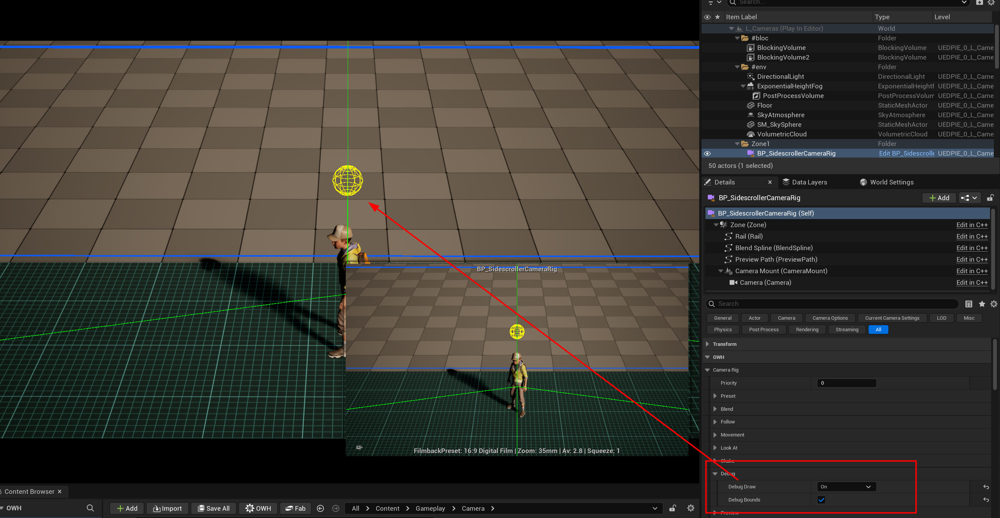

> **Иллюстрация 2.** Отладочная отрисовка в PIE: верхняя сфера — точка на
> персонаже с учётом офсета, нижняя — точка на рельсе, зелёные линии между
> ними. Включается в категории `Debug` — см. раздел «Отладка».

Первые 5 секунд игрового времени интерполяции нет — крепление ставится сразу в
нужную точку, чтобы камера не «прилетала» на старте уровня.

### У рига это устроено иначе

Шаги 1–4 те же, но шаг 2 и шаг 5 переписаны 2026-08-21.

**Сглаживание живёт в расстоянии по рельсу, а не в мировых координатах.**
Старый путь тянет крепление к целевой точке через `VInterpTo`, то есть по прямой
между двумя точками — а прямая между двумя точками изогнутого сплайна проходит
мимо него. Риг интерполирует само расстояние вдоль сплайна и берёт точку уже по
нему, поэтому камера находится на рельсе каждый кадр, а не только когда догнала.

**Сглаживание задаётся временем, а не скоростью.** `InterpSpeed` у рига
называется `Rail Damping` и меряется в секундах: это *постоянная времени*, за
которую камера проходит примерно 63% оставшегося расстояния. 0.1 — жёстко,
1.0 — лениво, 0 — камера приколота к точке на рельсе.

Кривая при этом ровно та же, что была: `FInterpTo` со скоростью `S` — это
экспонента с постоянной времени `1/S`, то есть старое число всегда переводится
в новое делением единицы на него.

| Было (скорость) | Стало (секунды) | Ощущение |
| --- | --- | --- |
| 10 | 0.1 | камера приклеена |
| 5 | 0.2 | быстро |
| **3** | **0.333** | значение по умолчанию, как раньше |
| 2 | 0.5 | заметно мягко |
| 1 | 1.0 | лениво |

**Точка слежения сглаживается отдельно и по осям** — `Follow Damping`, вектор
времён. Риг сглаживает не камеру, а *представление о том, где игрок*, и уже из
этой точки считает и место на рельсе, и направление взгляда. Разница
принципиальная: сгладить камеру значит замедлить всё сразу, а здесь можно
погасить вертикаль, не трогая горизонталь.

Ради этого настройка и существует: по умолчанию `Follow Damping = (0, 0, 0.2)`,
то есть **прыжок персонажа почти не доходит до кадра**, а бег отслеживается так
же быстро, как раньше. Ноль по всем трём осям возвращает поведение до правки.

Порядок важен: сглаживание стоит выше всего остального, потому что место на
рельсе и точка взгляда — два ответа об одном и том же положении игрока, и
сглаживать их по отдельности значит разрешить им разойтись во мнении о том, где
игрок находится. Камера, которая стоит на месте, но задирается за прыжком, — это
ровно тот рывок, который убирается.

Смещение переносится на взгляд **только когда камера смотрит на того же, за кем
едет**. Look-at вольюм и заполненный `Actor To Track` называют цель намеренно, и
подмешивать в неё то, как подпрыгивает игрок, значит целиться мимо неё.

**Точка на рельсе выбирается одним из двух способов** — `Rail Follow Mode`:

- **`Proportional`**, по умолчанию. Рельс делится поровну на путь игрока через
  зону: прогресс меряется вдоль **хорды рельса** — прямой от первой точки
  сплайна к последней, — и умножается на длину рельса. Камера проходит рельс
  целиком, от начала до конца, ровно один раз и в том порядке, в котором он
  нарисован. Для рельса, который возвращается в собственное начало (петля,
  крюк), хорды нет, и прогресс меряется по самой длинной оси коробки `Zone` —
  из трёх, включая высоту.

**Считается ли высота прогрессом, решает сам рельс.** У этого вопроса два
противоположных правильных ответа, и оба нужны:

- На маршруте, который идёт **вбок**, высота — это прыжок. Считать её значило бы
  сдвигать камеру вдоль рельса каждый раз, когда игрок подпрыгнул, поэтому
  вертикальная составляющая хорды отбрасывается.
- На секции **лазания** высота и есть весь прогресс. Отбросить её значит
  оставить камеру стоять внизу, пока персонаж лезет, — и выглядит это как
  сломанная механика, а не как настройка.

Поэтому рельс спрашивают, чего он делает больше. Поднимается сильнее, чем идёт
вбок, — меряется с подъёмом; идёт вбок сильнее, чем поднимается, — уплощается,
ровно как раньше. Настройки для этого нет и не нужно: третьего случая, в котором
хотелось бы другого ответа, не существует.

Проверить, что камера думает о конкретной точке, можно `GetRailProgressAt` —
она отдаёт те же 0…1, которыми пользуется сам риг.
- **`Closest Point`** — геометрически ближайшая точка, то есть поведение старой
  тройки. На изгибе ближайшая точка может лежать на совсем другом участке рельса,
  и старый код телепортировался туда; у рига ход ограничен
  `Max Rail Travel Speed`, так что вместо прыжка камера доезжает.

### Радиус покоя

Сглаживание отвечает на вопрос «как быстро», а не на вопрос «стоит ли вообще».
Персонаж, переступающий на месте, двигает точку слежения на пару сантиметров
туда и обратно, и камера послушно едет за ней: кадр всё время слегка дышит.

`Follow Dwell Radius` — сфера вокруг той точки, которую камера **уже приняла** за
место персонажа. Пока измеренная точка внутри сферы, камера получает старую и не
двигается вообще. Выход из сферы двигает её центр **на край сферы**, а не к
персонажу.

Это то же правило, по которому отпускает угловое мёртвое пятно (§7): зона,
догоняющая свой предмет до середины, — это пауза, за которой следует рывок, и она
хуже, чем отсутствие зоны. Ноль выключает всё это целиком.

Радиус применяется **до** сглаживания и до всего остального. Точка на рельсе,
прицел и упреждение считаются из одной и той же believed-позиции, поэтому
неподвижность, применённая позже, дала бы камеру, которая стоит на месте, но
продолжает доворачиваться на шорох.

### Базис движения персонажа

Отдельная от кадра вещь, которую риг тоже решает: **куда бежит персонаж, когда
игрок жмёт «вправо»**.

Ввод собирается от поворота камеры — `Get Player Camera Manager` →
`Get Camera Rotation`, — поэтому камера, поставленная на пару градусов мимо
квадрата, уводит бег по диагонали ровно на эти градусы, а трясущаяся камера
заставляет персонажа вилять.

При включённом `Stabilize Movement Basis` риг отдаёт вместо поворота камеры
**направление собственной зоны**, повёрнутое на четверть — ту из двух четвертей,
которая уводит от камеры, так что экранное «вправо» остаётся экранным «вправо», а
«вперёд» — «от камеры». Правка применяется в
`UOWH_CharacterMovementComponent::ConsumeInputVector` одним поворотом вокруг Z:
всё, что собирает ввод, продолжает собирать его от камеры и про риг не знает.

**Почему зона, а не рельс.** До 25 августа базис брался от касательной к рельсу в
той точке, где стоит камера. На прямом рельсе это одно и то же, на изогнутом —
нет: касательная поворачивается по мере проезда камеры, и вместе с ней
поворачивалось «вперёд» под руками игрока. Теперь одна зона — одно направление
управления, каким бы ни был нарисован рельс внутри неё. Коридор, который
действительно поворачивает, набирается из двух зон.

Четверть выбирается **по положению камеры, а не по её взгляду**: на изогнутом
рельсе камера доворачивается, и выбор, сделанный по её повороту, перевернул бы
управление посреди зоны в тот момент, когда она уйдёт за девяносто градусов.

**Смена базиса ждёт конца переезда.** `UOWH_CameraStatics::FindViewOwningRig`
отвечает тем ригом, через который игрок сейчас *смотрит*, — то есть во время
бленда всё ещё старым; `PendingViewTarget` намеренно не спрашивается. До
25 августа было наоборот, из соображения «пусть ввод согласуется с местом
назначения ещё до приезда». Игра показала обратное: базис всё равно обязан
когда-то смениться, и смена в начале бленда ложится поверх уже едущей картинки —
две подвижные вещи сразу. Та же смена на остановившемся кадре не замечается.

**Почему вообще ось, а не камера.** Управление от камеры было бы честнее и не
требовало бы ни этой ручки, ни этого кода — но только на стике, где доступен
любой угол. На клавиатуре направлений восемь, и коридор, не параллельный экрану,
становится непроходимым вдоль: кнопка «вправо» уводит в стену под углом.

### Ось зоны — это её локальный X

`GetForwardVector` возвращает локальный X, и конструктор рига рисует рельс по
умолчанию вдоль него же:
`Rail->AddSplinePoint(FVector(±DefaultZoneExtent.X, 0, 0))`. Значит зона по
построению — коридор вдоль X, и `Box Extent` по X должен быть наибольшим.

Зона, вытянутая по Y, не «повёрнута» — у неё развёрнуто на четверть всё, что
считается от оси. Это не настройка и не вкус: `DefaultZoneExtent` объявлен как
`(800, 200, 200)`, и весь остальной код читает эту договорённость.

### Камера вдоль оси зоны: ось перестаёт отвечать

У выбора четверти есть вырожденный случай. Знак определяется скалярным
произведением вектора «от камеры к центру зоны» на перпендикуляр к оси, и когда
камера смотрит **вдоль** зоны — стоит за спиной персонажа или перед его лицом, —
оба кандидата равноудалены, произведение обращается в ноль для обоих, и знак
достаётся тому, в какую сторону случайно склонился тай-брейк.

Две такие постановки при этом выбирают **одно и то же мировое направление**, а
показывают зеркальные картинки. Значит одна из двух перевёрнута относительно
того, что видит игрок, и обе к тому же повёрнуты на четверть оборота: стик
«вправо» уводит вглубь кадра. Владелец сообщил об этом с обоих концов 2026-08-27.

**Ось может отвечать только пока камера смотрит поперёк неё.** Поэтому меряется
выравнивание — модуль косинуса между уплощённым направлением взгляда камеры и
осью зоны, — и по мере того как камера поворачивается к оси, ответ отдаётся яву
самой камеры:

| Выравнивание | Что отвечает |
| --- | --- |
| до 0.70 (45° и больше от оси) | ось зоны, ровно как раньше |
| 0.70 … 0.95 | смесь, по `SmoothStep` |
| от 0.95 (18° и меньше от оси) | яв камеры |

Полосой, а не порогом: порог — это место на уровне, где управление меняется на
девяносто градусов между двумя шагами, то есть уменьшенная копия того самого
дефекта. Камера сбоку получает прежний ответ до последнего бита.

Практическое следствие: вид от третьего лица и вид навстречу персонажу теперь
просто работают, и выключать ради них `Stabilize Movement Basis` не нужно.

Измеренный случай до правки, `L_Cameras`, 2026-08-25: у рига арки
перпендикулярная составляющая была **12 см при удалении 1247** — камера в 0,56°
от оси. Управление переворачивалось от любого прикосновения к зоне, и по
внешнему виду уровня причину найти было нельзя.

Квадратная в плане зона остаётся плохой идеей по другой причине: у квадрата
длинной оси нет, и `GetForwardVector` возвращает направление, которое никто не
выбирал. Зона под коридор должна быть вытянутой, камера — стоять сбоку.

Выключенная галочка, отсутствие рига в кадре и AI-пешка дают ровно прежнее
поведение — вектор не трогается вообще.

---

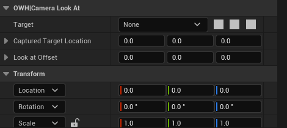

> *Look-at вольюм. Мягкая ссылка на предмет и запомненная мировая точка — камера целится в точку, пока предмет выгружен.*

## 5а. Бленд принадлежит ригу

Движковый `SetViewTargetWithBlend` умеет одно: доехать по прямой за одно
заданное время и не вернуться. Нужны были три вещи, которых он не даёт, —
откат назад, траектория по сплайну и разное время туда и обратно. Поэтому
**вид забирается мгновенно, а переезд риг ведёт сам**, в `CalcCamera`:

1. В момент активации запоминается, **кто** держал кадр (`BlendSourceActor`), и
   этот источник получает `HoldAsBlendSource` — он продолжает следить за
   игроком, хотя кадра у него уже нет. Без этого откат приезжал бы к камере,
   застывшей там, где игрок был минуту назад.
2. Каждый кадр POV источника спрашивается заново, а не берётся замороженным.
3. `CalcCamera` смешивает POV источника и свой собственный по альфе, сглаженной
   движковой же `FViewTargetTransitionParams::GetBlendAlpha` — чтобы `Blend
   Curve` означала ровно то, что всегда означала.
4. Положение берётся из `ResolveBlendLocation`: прямая, либо точка на
   `BlendSpline`. **Форма сплайна натягивается на реальные концы**: к точке на
   сплайне прибавляется интерполированная невязка его начала и конца
   относительно двух камер. Поэтому оба конца всегда точны, а прямой сплайн
   арифметически сводится к прямому бленду.
5. **Интерполируется композиция, а поворот считается из неё один раз.** См.
   ниже — это отдельный разговор и главный из них.

### Смешивается состояние кадра, а не готовая поза

Смешивать два готовых поворота — значит смешивать композицию двух ригов способом,
которого не просил ни один из них. У каждого поворота уже применены своя точка
кадра, своя мёртвая зона, свои клампы и своё демпфирование; результат — не
камера, которая по дороге меняет характер, а наложение двух чужих камер.

Поэтому композиция стала **значением** — `FOWH_CameraFraming`, — а прицел стал
**функцией** от него: `UOWH_CameraStatics::ResolveAim`. У функции два вызывающих.
`UpdateFraming` зовёт её со своей композицией; переезд зовёт её один раз с
композицией двух ригов, смешанной той же сглаженной альфой, которой смешивается
картинка, из интерполированного места и по интерполированной точке прицела.

Точка, а не направление: точка одна и та же, с какой бы стороны камера ни
приехала, а направление верно только из того места, где его померили. Это и
держит персонажа в кадре на выгнутом сплайне бленда.

**Тумблеры до функции не доезжают, и это цель, а не потеря.** У `bool` нет
середины: смешивать его — значит переключить на половине пути, то есть получить
тот же шов в уменьшенном виде. «Не поворачиваться по этой оси» — это то же
высказывание, что вес ноль между авторским углом и посчитанным; «не клампить» —
это диапазон ±180. В таком виде обе величины интерполируются, а замороженный и
заклампленный случаи совпадают с прежними побитово.

**Оба конца точны по построению.** Память демпфирования засевается от источника в
начале переезда и отдаётся в `LastLookAtRotation` в конце, поэтому шов не
переехал из середины на края. Источник не из наших ригов — катсцена, пешка —
композиции не отдаёт, и для него остаётся прежний slerp: состояние, которого
нельзя прочитать, нельзя и смешать.

**Считается один раз за кадр, в `Tick`, а `CalcCamera` только читает.**
`CalcCamera` может быть вызван несколько раз за кадр и в порядке, которым риг не
управляет, а демпфирование — это состояние; картинка, зависящая от того, кто
успел спросить первым, менялась бы от вещей, к камере отношения не имеющих.

Побочный и не менее важный результат: прицел теперь можно проверить **без мира,
актора, камеры и игрока**. `.scripts/ue/owh-168-verify.py` меряет каждое правило
по отдельности — что камера смотрит на предмет, что точка кадра доворачивает её
ровно на названный угол, что мёртвая зона держит и отпускает на край, что кламп
меряется от авторского угла, что вес ноль ложится на него, а вес половина —
ровно посередине.

### Разворот на полпути, и что он стоит

Отбой — это не второй переезд, а тот же самый, пущенный назад: `BlendPct` идёт с
той же скоростью, только со знаком минус. Знак раньше переворачивался в один
кадр, и это давало разрыв не в положении камеры, а в её **скорости**: замер по
логу поз показал −60 → +123 см/с между двумя кадрами, четыре раза за один
прогон. Выходя из зоны камера обычно опускается, поэтому разворот бросает кадр
вверх — и жалоба звучит как «подбрасывает», а не как «дёргается».

Кривая бленда сглаживает оба конца пути и не знает ничего о смене направления
посреди него. Поэтому сглаживается сама скорость: `BlendReverseEase` — время, за
которое темп доводится до обратного. Ноль возвращает мгновенный разворот.

### Возврат вида отдаёт то, на чём стояла картинка

Дойдя до нуля, отбой отдаёт вид исходному ригу срезом. Срез предполагал, что
смешанная поза уже сошлась с собственной позой источника, — она не сходится.
Поворот на переезде считается через **своё** демпфированное состояние, и при
постоянной в секунду полусекундный отбой оставляет его на два с половиной
градуса позади. Вперёд эти состояния мирились всегда: `EndBlend` отдаёт своё тому
ригу, на котором приземляется. Назад — не мирились, и щелчок был виден в каждом
возврате.

Теперь исходный риг получает поворот, на котором реально стояла картинка, и
уезжает к своему ответу за своё демпфирование. Замер: шаг по тангажу упал с
2.43° до 0.001–0.47°.

Отбой заодно заводит удержание перехода, как любая обычная передача вида. Раньше
он его не заводил вовсе, и следующий переезд мог начаться на следующем же кадре —
в логе вид дважды перескакивал между ригами за 58 и 242 миллисекунды.

### Flip-flop

Если игрок возвращается в вольюм, из которого только что вышел, **пока переезд
ещё идёт**, предыдущий риг не начинает новый бленд. Он находит, что текущий риг
едет именно от него (`IsBlendingFrom`), и просит его развернуться
(`ReverseBlend`). Альфа идёт назад со скоростью `Blend Out Time`, и в нуле кадр
отдаётся источнику срезом — в нуле обе картинки совпадают, так что переход не
виден. Развернуться можно и обратно: войдя снова, игрок снова разворачивает тот
же бленд.

**Раньше здесь была дыра, и её больше нет.** Пока переключения были событийными,
пара перекрытых зон после отката оставалась на первой камере, пока игрок не
выйдет из второй и не войдёт заново. Со стеком (§4) выход из зоны — такое же
изменение состояния, как вход, и пересчёт происходит сам.

Откат при этом стек **не задерживает** — ни удержанием, ни отложенным тиком.
Разворот бленда не передача кадра, а её отмена: игрок уже повернул назад, и
камера, которая продолжала бы уезжать от него ещё четверть секунды, — это ровно
тот дефект, ради которого откат и написан. Обратный случай тоже учтён: если
игрок в середине разворота передумал и вернулся, риг, который держит кадр, и
риг, который должен его держать, — это один и тот же риг, и подсистема
специально спрашивает его ещё раз, вместо того чтобы решить, что менять нечего.

### Таблица переездов: переход принадлежит паре

Время, кривая, показатель и удержание жили на риге, **на который** переходим.
Значит вход в зону — одно и то же событие, откуда бы в неё ни пришли; а вход в
арену из коридора и вход в неё же с балкона — разные монтажные события.

`UOWH_CameraBlendList` — дата-ассет, один на игру, названный в
**Project Settings → Game → OWH Camera**. Внутри один массив правил; у правила
два тега (`From Camera`, `To Camera`) и настройки переезда. Риг несёт своё имя в
`Camera Tag`.

Язык этой таблицы — три предложения:

- правила читаются сверху вниз, **побеждает первое подошедшее**;
- **пустой тег значит «любая камера»**;
- **названный тег ловит и своих детей** (`Camera.Corridor` подходит и
  `Camera.Corridor.Narrow`).

Из этого следует всё остальное. Точная пара, «от этой к любой», «к этой от
любой» и дефолт — это одинаковые строки, а их приоритет — тот порядок, в котором
их поставил дизайнер. Отдельного ведра исключений нет, запоминать схему
старшинства не нужно, и правило с двумя пустыми тегами внизу списка — это
дефолт, а оно же наверху означало бы, что все переезды в игре одинаковы.

Правило задаёт переезд **целиком**: это одно высказывание о том, что такое этот
переход, а не набор независимых переопределений. Два исключения — те две
величины, у которых уже есть собственное написание «оставь как есть»: кривая
`Inherit` и `Reverse Time` равное нулю.

**Чего таблица не сказала, то говорит риг.** Пара, которой в таблице нет,
сохраняет собственные `Blend In Time`, кривую и удержание рига; проект без
назначенного ассета ведёт себя в точности как до появления таблицы. Ответ
резолвится один раз, в начале переезда, и держится до его конца: правка таблицы
не должна менять переход, который уже идёт наполовину.

Какая строка ответила, видно в логе:
`OWH_RIG blend table rule 2 rig=… from=… to=… time=1.50 hold=0.25`. Номер строки
и есть тот вопрос, который задаёт дизайнер, когда переезд его удивил.

### Удержание перехода

Стоя ровно на границе двух зон, игрок может входить в перекрытие и выходить из
него **через кадр**, и без защиты вид перебрасывается между двумя ригами по
нескольку раз в секунду — это читается не как спор двух камер, а как трясущаяся
картинка.

`Transition Hold Time` (0.25 с по умолчанию) — время после взятия вида, в
течение которого никакая камера не может взять его снова. Часы **общие на весь
мир**: они лежат в `UOWH_CameraDirectorSubsystem`, а не на риге, потому что часы
на каждом риге позволили бы двум ригам меняться по очереди на полной скорости,
и каждый был бы уверен, что честно подождал.

Три вещи удержание намеренно **не** блокирует:

- **Откат бленда.** Шаг назад в только что покинутый вольюм — это отмена
  перехода, а не заявка на новый, и разворот идёт немедленно.
- **Первый кадр уровня.** Переход от пешки или от контроллера — это старт, а не
  передача между камерами; удерживать там нечего.
- **Явный вызов `Activate`.** Скриптовый захват уже принял решение; удержание
  существует ради спора двух *зон*, а не ради него.

Ригу, которому отказали по удержанию, отказ не забывается: он встаёт в ту же
очередь ожидания, что и риг, у которого вид отобрала катсцена, и берёт кадр сам,
как только время вышло, — без выхода и повторного входа в зону.

Короткое удержание никогда не сокращает уже идущее: иначе риг с маленьким
`Transition Hold Time`, подошедший в середине чужого ожидания, открывал бы дверь
сам себе.

## 6. Три сплайна рига, и который из них какой

На риге висят три сплайна, и до сих пор движок рисовал все три одинаковым белым:
отличить их можно было только выделив компонент и посмотрев, что подсветилось.
Теперь у каждого свой цвет — те же, что в палитре этого документа.

| Компонент | Что это | Когда виден |
| --- | --- | --- |
| `Rail` | **Жёлтый — путь камеры.** Линия, по которой камера едет, пока игрок идёт через зону. Это тот сплайн, который рисуют всегда. | всегда |
| `Blend Spline` | **Фиолетовый — как камера приезжает** с предыдущей камеры. Без него переезд идёт по прямой; с ним — по нарисованной дуге. | при `Use Blend Spline` |
| `Preview Path` | **Зелёный — где, как ожидается, пойдёт персонаж.** В игре не участвует вообще: по нему ходит болванка, когда кадр репетируют в редакторе, не запуская PIE (§14). | при включённой репетиции |

Порядок такой: жёлтый — про камеру, зелёный — про персонажа, фиолетовый — про
переход между двумя камерами. Выделенный сплайн в любом случае становится белым,
так что цвет отвечает на вопрос «что это», а выделение — на вопрос «что я сейчас
двигаю».

Жёлтый рисуется из коробки вдоль зоны, отодвинутый на 8 метров по Y и поднятый на
2 по Z. Фиолетовый и зелёный из коробки лежат прямыми и скрыты, пока не включена
соответствующая настройка.

**Сплайна глубины больше нет.** До 25 августа на риге был четвёртый — `DepthRail`,
второй путь под флагом `bSplineDepth`, задававший удалённость камеры отдельно от
её позиции вдоль сцены. Он снят по решению владельца: удалённость задаётся
`Camera Position Offset` и самой формой рельса, а второй сплайн стоил ещё одной
сущности в кадре и ещё одного флага в панели. Настройки `Spline Depth` и
`Spline Depth Distance Offset` исчезли вместе с ним.

## 7. Куда камера смотрит

Поворотом занимается не рельсовая логика, а сама камера — движковый механизм
`Look at Tracking` из `CineCameraActor`, расширенный в нашем классе
`AOWH_CineCameraActor`.

- **`Actor to Track`** — за кем следить. Если поле пустое, система при
  переключении сама подставит туда персонажа. Если дизайнер выбрал конкретный
  объект — система его не трогает, и камера будет смотреть на этот объект.
- **`Relative Offset`** — сдвиг точки взгляда относительно объекта. По умолчанию
  +50 по Z, то есть камера целится примерно в корпус, а не в ноги.
- **`Look at Tracking Interp Speed`** — как быстро камера доворачивается. По
  умолчанию 1, то есть заметно мягко.
- **`bAllowPitch` / `bAllowYaw`** (наше расширение) — разрешить камере
  доворачиваться по вертикали и по горизонтали. Выключенная ось замораживается
  в том положении, в котором актор стоит на уровне.
- **`bClampPitch` + `PitchClampRange`**, **`bClampYaw` + `YawClampRange`** —
  ограничить доворот. Диапазоны по умолчанию −30…30 и −15…15.

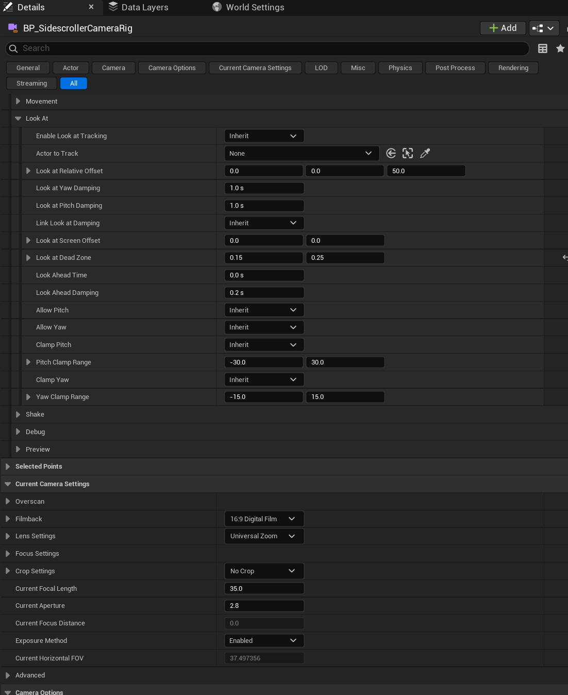

> **Иллюстрация 3.** Details рига: раскрытая категория `Look At` — наши ручки
> слежения — и `Current Camera Settings` самой кинокамеры, где фокусное
> расстояние, диафрагма и сенсор.

Кроме этого камера — полноценная `CineCamera`: фокусное расстояние, диафрагма,
фокус, размер сенсора работают как обычно и на кадр влияют сильнее всего.

### У рига: мёртвая зона, точка кадра и упреждение

Риг доворачивается сам, не через движковый `Look at Tracking`, и добавляет к
нему три вещи. Все три считаются **в углах**, а не в пикселях: доля кадра
переводится в градусы через `atan(доля · tan(половина угла обзора))`, вертикаль
— через аспект сенсора камеры. Поэтому они работают и на headless-хосте, где
вьюпорта нет, и не зависят от размера окна игрока.

**`Look At Screen Offset`** — где в кадре стоит персонаж, считая от середины, в
долях всего кадра. `0.25` по X ставит его на четверть кадра правее центра,
положительный Y поднимает. Ноль — середина, как было всегда.

**`Look At Dead Zone`** — прямоугольник вокруг этой точки, тоже в долях кадра,
внутри которого персонаж двигается, **а камера не поворачивается вообще**.
Выйдя за край, камера доворачивается ровно настолько, чтобы вернуть его **на
край**, а не в середину: вернуть в середину — это то же самое, что камера без
мёртвой зоны, только с задержкой, то есть хуже обоих вариантов.

Ноль — мёртвой зоны нет и поведение прежнее. Разумная отправная точка для
сайдскроллера — `0.15` по X и `0.25` по Y: шаги и мелкие прыжки кадр не будят,
а настоящее перемещение — будит.

> Доля кадра и половина ширины — не одно и то же число, и в коде это две разные
> строки. Размер мёртвой зоны `0.3` означает коробку в три десятых кадра
> шириной, то есть половину этого в каждую сторону; смещение `0.25` означает
> четверть кадра целиком. Первое переводится в NDC как есть, второе —
> удваивается.

**`Look Ahead Time`** — на сколько секунд собственного движения субъекта камера
смотрит вперёд. При `0.4` персонаж, бегущий 400 см/с, кадрируется так, будто он
уже на 160 см дальше, — камера ведёт бег, а не тащится за ним. Ноль выключает.

Скорость перед этим сглаживается своим временем `Look Ahead Damping` (0.2 с по
умолчанию). Без сглаживания разворот на месте меняет знак скорости за один кадр,
и упреждение перебрасывает кадр через весь уровень.

Упреждение берётся **у того, за кем камера смотрит**, а не у игрока: риг,
наведённый на движущийся лифт, ведёт лифт. Look-at вольюм упреждения не даёт
совсем — он называет место, выбранное дизайнером, и вести это место чужой
скоростью значит целиться мимо того, на что велено смотреть. По той же причине
вольюм и `Actor To Track` не заимствуют сглаживание точки слежения (см. §5).

**Наклон и поворот демпфируются раздельно** — `Look At Yaw Damping` и
`Look At Pitch Damping`, обе в секундах, с галочкой `Link Look At Damping`,
которая заставляет наклон брать число поворота. Раздельно они нужны почти
всегда: камера, которая панорамирует бодро и наклоняется медленно, читается как
намеренная, а та, что наклоняется так же бодро, — как нервная.

Демпфирование идёт по короткой дуге, поэтому доворот от 179° к −179° — это два
градуса, а не триста пятьдесят восемь.

Порядок внутри кадра: прицел в субъекта → сдвиг точки кадра → клампы → мёртвая
зона → демпфирование → заморозка выключенных осей. Мёртвая зона стоит после
клампов и до демпфирования: до клампов она удерживала бы камеру у предела,
который ей и так велено соблюдать, а после демпфирования — спорила бы с ним за
те же градусы.

---

## 7а. Субъект — это объём

Субъект рига был указателем на актора плюс одно смещение, то есть **точкой**, а у
точки нет размера. Подойди к камере вплотную — начало координат послушно стоит в
середине кадра, а голова уходит за его верх. При этом всё, из чего состоит
композиция — какую долю кадра занимает субъект, сколько взять объектива, куда
поставить фокус, — это вопросы о размере, и ни один из них задать было нельзя.

`FOWH_CameraTarget` называет актора, компонент на нём и кость, берёт баунды
найденного или заданный руками радиус, несёт смещение и вес, и разрешается в
мировую коробку. **У кости размер всегда берётся из радиуса**: спросить баунды у
скелетал-меша, целясь в голову, — значит получить всего персонажа с раскинутыми
руками, и это ровно та ошибка, ради которой структура и заведена.

Несколько целей складываются так: коробка — объединение (кадр обязан содержать
всех), середина — среднее по весам (где между ними стоит рамка — это выбор).

### Правило кадрирования почти не меняется

Мировая коробка, увиденная из камеры, — это угловой прямоугольник: полууглы по
яву и по питчу, посчитанные **по восьми углам**, потому что ближняя грань шире на
экране, чем дальняя.

Правило «держись, пока субъект внутри коробки, потом отпусти его на её край» с
субъектом, у которого есть ширина, — это то же правило с зоной, ужатой на его
полуугол:

```
эффективная мёртвая зона = max(мёртвая зона − полуугол субъекта, 0)
```

Один член в одной строке. Субъект шире зоны даёт ноль и центрируется — уместить
его иначе нельзя. Полууглы лежат в `FOWH_CameraFraming`, поэтому бленд
интерполирует их вместе со всем остальным даром: два рига, смотрящие на
по-разному крупных субъектов, смешиваются без единой дополнительной строки.

Выключено по умолчанию (`bFrameSubjectVolume`): включение делает любую уже
настроенную мёртвую зону теснее на ширину субъекта, а принятый кадр не должен
меняться оттого, что появилась возможность.

### Объектив и фокус

`ResolveSubjectFov` — это проекция, пущенная назад. Точка под углом T стоит на
`tan T / tan(HalfFov)` кадра, значит объектив, ставящий край субъекта туда, куда
надо, имеет `tan(HalfFov) = tan T / доля`.

**Считается по обеим осям, и побеждает более широкий ответ.** Стоящий персонаж
узкий и высокий: решение только по ширине сажает его плечи на треть кадра и
срезает голову. Это не рассуждение — это поймал отрисованный кадр: первая версия
уводила фигуру в телевик, в упор `Min Fov`.

Дистанция фокуса — расстояние до субъекта плюс смещение, записанное в
CineCamera с методом `Manual`; метод переключается ригом, потому что дистанция,
записанная в камеру со `Disable`, не делает ничего и выглядит как ошибка в этом
коде.

**Сам объектив тоже принадлежит пресету.** Сенсор и линза называются по имени из
Project Settings, фокусное и диафрагма — числами; всё это применяется к
компоненту в `RefreshSettings`, в порядке сенсор → линза → фокусное → диафрагма →
метод фокуса, так что написанное числом перебивает то, что принесла именованная
линза. После применения заново снимается `AuthoredFov`: иначе динамический FOV и
объектив от поджатия считались бы от прежней линзы.

Пустая строка, ноль и `Inherit` не трогают компонент. Это то, что позволяет
назначить пресет старому ригу, не сломав ему кадр, — и то, почему пресет,
заведённый до появления этих полей, ведёт себя как раньше.

## 7б. Камера и геометрия

Столкновение — **постпроцесс на готовой позиции**, а не шаг внутри слежения.
`ResolveCameraTarget` последней строкой отдаёт свой ответ, и обе половины
остаются в неведении друг о друге: логика рельса не знает, что столкновение
существует, а столкновение не знает, как получилась позиция. Выключенное — а по
умолчанию оно выключено — не выполняет запроса вовсе, и ответ возвращается до
бита тем же, каким был.

**Щуп идёт от субъекта наружу, никогда от камеры внутрь.** В обратную сторону он
стартует внутри того, во что камера уже зарылась, сообщает начальное
проникновение и нулевую дистанцию, и камера прыгает персонажу в лицо — тот самый
дефект, которым эта возможность знаменита в чужих проектах.

### Два предела на одно число

Дистанция, на которой камере позволено стоять, ограничена с одной стороны
дважды:

- **потолок на потерю** — сколько кадра можно отдать (`Collision Max Pull In`);
- **пол на близость** — насколько близко можно подойти (`Collision Min
  Distance`).

Это разные предложения об одном числе, и связывающим оказывается **больший** из
них. Камера, поставленная ближе пола, остаётся где стояла: пол здесь для того,
чтобы столкновение не вдавливало камеру в персонажа, а не для того, чтобы
двигать кадр, выстроенный руками.

### Несимметричный возврат

Внутрь — мгновенно, наружу — за `Collision Restore Time`. Асимметрия и есть вся
суть: стена появляется между двумя кадрами, и камера, плавно въезжающая в ответ
за треть секунды, — это камера, треть секунды стоящая в геометрии. У дороги
наружу такого срока нет, и мгновенный отскок оттуда — то, по чему любую камеру
третьего лица и узнают как плохую.

### Объектив от поджатия

`Collision Fov Curve` — это `Runtime Float Curve`, нарисованная на месте, а не
отдельный ассет: кривая, которую никто не делит между двумя ригами, не нуждается
в имени, папке и сохранении. Поделиться ей всё равно можно, указав `External
Curve`.

Вход — доля отданного кадра, 0…1, где 1 значит «камера стоит на своём полу»;
выход — градусы, прибавляемые к углу обзора. **Кривая без ключей просит ноль**, и
это то, что делает расширение необязательным без второго флажка рядом с ним.

Доля меряется от того, сколько места было **что** терять, а не от желаемой
дистанции: одна и та же кривая читается одинаково на риге в двух метрах и на
риге в двадцати.

### Объектив собирается абсолютно

Об угле обзора теперь могут иметь мнение двое — динамический объектив и
поджатие, — поэтому кадр строит его **от авторского значения**, взятого один раз
и до того, как что-либо его тронуло. `SetFieldOfView` двигает фокусное
расстояние, так что прочитанное с компонента значение — это то, что было записано
в прошлом кадре; прибавка к нему за пару секунд свернула бы кадр в рыбий глаз.

## 8. Все параметры в одном месте

### На риге (`BP_SidescrollerCameraRig`) — то, что ставят на новых уровнях

Тумблеры трёхпозиционные: `Наследовать` / `Вкл` / `Выкл`. Без пресета
`Наследовать` означает значение по умолчанию класса — то, что стоит в колонке.
Числа при назначенном пресете складываются с ним, поэтому назначение пресета
обнуляет их на экземпляре (§13).

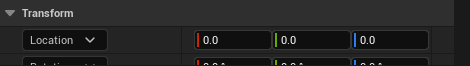

> *Приоритет. Кто побеждает, когда игрок стоит в двух зонах сразу.*

**Общее**

| Параметр | По умолчанию | Что делает |
| --- | --- | --- |
| `Preset` | пусто | общий набор настроек; без него все числа читаются как есть |
| `Priority` | 0 | кто побеждает при перекрытии зон; при равенстве — вошли позже |

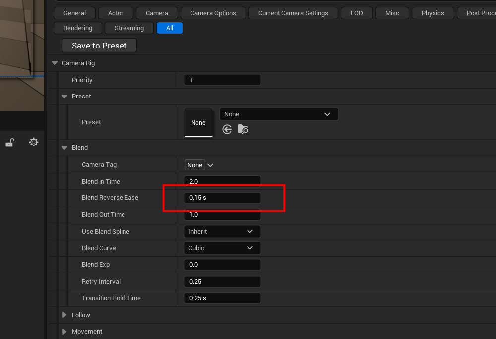

> *Переезд. Времена входа и выхода, кривая, сплайн бленда и удержание перехода.*

**Переезд**

| Параметр | По умолчанию | Что делает |
| --- | --- | --- |
| `Camera Tag` | пусто | имя камеры для таблицы переездов (§5а) |
| `Blend In Time` | 2.0 с | переезд сюда с предыдущей камеры; таблица может его перебить |
| `Blend Out Time` | 1.0 с | тот же путь назад при откате |
| `Blend Reverse Ease` | 0.15 с | за сколько темп переезда доводится до обратного при развороте на полпути; ноль — мгновенно |
| `Blend Curve` | `Cubic` | форма кривой |
| `Blend Exp` | 0.0 | показатель для `EaseIn/Out/InOut` |
| `Use Blend Spline` | Наследовать → выкл | ехать по нарисованной траектории |
| `Retry Interval` | 0.25 с | как часто пробовать забрать вид у катсцены |
| `Transition Hold Time` | 0.25 с | сколько после переключения никто не может забрать кадр |

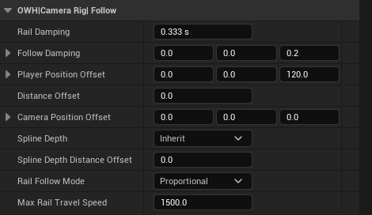

> **Слежение по рельсу.** Панель, снятая с чистого экземпляра — значения в
> таблицах ниже и в картинке взяты из одного места.

**Слежение по рельсу**

| Параметр | По умолчанию | Что делает |
| --- | --- | --- |
| `Rail Damping` | 0.333 с | за сколько камера догоняет точку на рельсе; 0 — приколота |
| `Follow Damping` | (0, 0, 0.2) с | сглаживание точки слежения **по осям**; Z гасит прыжок |
| `Player Position Offset` | (0, 0, 120) | точка на персонаже, которую проецируют на рельс |
| `Follow Dwell Radius` | 0 см | сфера покоя: внутри неё камера не двигается вовсе (§5) |
| `Frame Subject Volume` | Наследовать → выкл | мерить мёртвую зону по объёму субъекта (§7а) |
| `Look At Targets` | пусто | субъекты кадра с костями, размерами и весами (§7а) |
| `Dynamic Fov` | Наследовать → выкл | камера сама подбирает объектив |
| `Subject Frame Size` | 0.35 | какую долю кадра занимает субъект |
| `Min Fov` / `Max Fov` | 20° / 110° | пределы, между которыми ходит объектив |
| `Fov Damping` | 0.3 с | за сколько успокаивается зум |
| `Set Focus Distance` | Наследовать → выкл | ставить фокус на субъекта |
| `Focus Distance Offset` | 0 см | сместить фокус ближе или дальше него |
| `Distance Offset` | 0.0 | сдвиг вдоль рельса: плюс — вперёд |
| `Camera Position Offset` | (0, 0, 0) | постоянный сдвиг камеры в мире |
| `Rail Follow Mode` | `Proportional` | как выбирается точка на рельсе (§5) |
| `Max Rail Travel Speed` | 1500 см/с | ограничение хода в режиме `Closest Point` |

**Столкновение**

| Параметр | По умолчанию | Что делает |
| --- | --- | --- |
| `Camera Collision` | Наследовать → выкл | не пускать камеру в геометрию — раздел «Камера и геометрия» |
| `Collision Probe Radius` | 12 см | радиус шарика, которым щупается место |
| `Collision Min Distance` | 60 см | ближе к персонажу камера не подойдёт |
| `Collision Max Pull In` | 0 см | сколько кадра можно отдать; ноль — предела нет |
| `Collision Restore Time` | 0.4 с | за сколько уезжает обратно; внутрь всегда мгновенно |
| `Collision Fov Curve` | пусто | доля отданного кадра → градусы объектива |

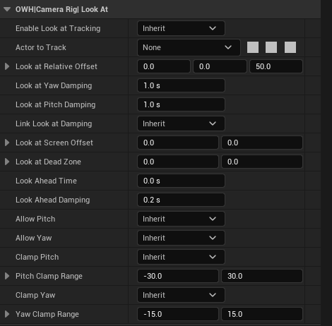

> *Куда смотрит. Демпфирование поворота и наклона, точка кадра, мёртвая зона, упреждение и клампы — одна категория целиком.*

**Куда смотрит**

| Параметр | По умолчанию | Что делает |
| --- | --- | --- |
| `Enable Look At Tracking` | Наследовать → вкл | доворачиваться вообще |
| `Actor To Track` | пусто | пусто — следит за персонажем; в пресет не входит |
| `Look At Relative Offset` | (0, 0, 50) | куда целиться на объекте |
| `Look At Yaw Damping` | 1.0 с | за сколько камера доворачивается по горизонтали |
| `Look At Pitch Damping` | 1.0 с | то же по вертикали, когда связка снята |
| `Link Look At Damping` | Наследовать → вкл | одно число на поворот и наклон |
| `Look At Screen Offset` | (0, 0) | где в кадре стоит персонаж, в долях кадра от середины |
| `Look At Dead Zone` | (0, 0) | коробка, внутри которой камера не поворачивается |
| `Look Ahead Time` | 0.0 с | на сколько секунд движения смотреть вперёд |
| `Look Ahead Damping` | 0.2 с | сглаживание скорости под упреждение |
| `Allow Pitch` / `Allow Yaw` | Наследовать → вкл | выключенная ось замирает в редакторном кадре |
| `Clamp Pitch` + `Pitch Clamp Range` | выкл, −30…30 | предел наклона от авторского кадра |
| `Clamp Yaw` + `Yaw Clamp Range` | выкл, −15…15 | предел поворота от авторского кадра |

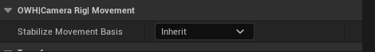

> *Базис движения. Одна галочка, но именно она решает, побежит ли персонаж по диагонали.*

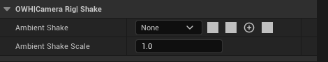

> *Тряска. Класс шейка и его масштаб; играет, пока риг держит кадр.*

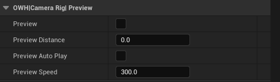

> *Репетиция. Скраббер, автопрогон и скорость болванки — всё `Transient`.*

**Движение персонажа, тряска, отладка, репетиция**

| Параметр | По умолчанию | Что делает |
| --- | --- | --- |
| `Stabilize Movement Basis` | Наследовать → вкл | «вправо» — вдоль зоны, а не относительно камеры |
| `Ambient Shake` + `Ambient Shake Scale` | пусто, 1.0 | тряска, пока риг держит кадр |
| `Debug Draw` | Наследовать → выкл | сферы на игроке и на рельсе, линия между ними |
| `Debug Bounds` | выкл | границы зоны и look-at вольюма в игре |
| `Preview` | выкл | репетиция в редакторе (§14) |
| `Preview Distance`, `Preview Auto Play`, `Preview Speed` | 0, выкл, 300 | крутилка, автопрогон и скорость болванки; `Transient` |

### На рельсе (`BP_SidescrollerCameraRails`)

| Параметр | По умолчанию | Что делает |
| --- | --- | --- |
| `Blend Time` | 2.0 | длительность перехода на этот рельс, в секундах |
| `BlendFunc` | `VTBlend_Cubic` | форма кривой перехода |
| `Blend Exp` | 0.0 | показатель для `VTBlend_EaseIn/Out/InOut` |
| `InterpSpeed` | 3.0 | как жёстко камера следует за игроком вдоль рельса |
| `DistanceOffset` | 0.0 | сдвиг камеры вдоль сплайна, в сантиметрах |
| `CameraPositionOffset` | (0,0,0) | постоянный сдвиг камеры в мире |
| `CameraMode` | `DistanceMode` | **не читается ничем**, см. «Расхождения» |
| `SplineDistance`, `bPrintSplineDistance` | 8000 / false | отладочные, в игре не участвуют |

### На переключателе (`BP_SidescrollerCameraSwitcher`)

| Параметр | По умолчанию | Что делает |
| --- | --- | --- |
| `To` | пусто | **рельс, на который переключаемся.** Обязательное поле |
| `InitialPositionOnRail` | −1.0 | **не читается ничем**, см. «Расхождения» |
| `LockRotation` | (0,0,0) | **не читается ничем**, см. «Расхождения» |

Размер и форму зоны задаёт `CollisionComponent` самого `TriggerBox`.

### На камере (`BP_SidescrollerCamera`)

Всё из раздела 7 плюс полный набор `CineCameraComponent`.

### На компоненте персонажа (`AC_SidescrollerCameraConnector`)

Значения здесь **перезаписываются при каждом переключении рельса**, поэтому
править их в блюпринте персонажа бессмысленно — кроме двух:

| Параметр | По умолчанию | Что делает |
| --- | --- | --- |
| `Player Position Offset` | (0,0,120) | точка на персонаже, которая проецируется на сплайн |
| `CameraMode` | `ClosestSplinePoint` | режим движения; реализован один |

---

## 9. Отладка

На компоненте `AC_SidescrollerCameraConnector` (в блюпринте персонажа) есть три
флага:

- **`bDebugDrawPositionOnRail`** — рисует сферу на игроке, сферу в целевой точке
  рельса и линию между ними. Первое, что нужно включить, если камера едет не
  туда.
- **`bDebugRailSplineMovementTestDirection`** и событие `DebugRailMovementTest` —
  автоматически водят персонажа вдоль рельса туда-сюда, чтобы посмотреть проезд
  без ручного управления.

Система также печатает на экран сообщения при отказах: `Cannot use this rail`,
`Cinematic camera active`, `no valid camera`, `level has not any camera actor`.
Если камера не переключилась — сообщение уже на экране, читать его.

Про столкновение спрашивать надо у лога, а не у экрана. Запуск с
`-LogCmds="LogOWH_SidescrollerCameraRig Verbose"` печатает по кадру четыре числа,
из которых состоит весь ответ:

```text
collision: wanted 847.6 blocked 210.4 allowed 210.4 (floor 60.0, cap 0.0)
```

`wanted` — куда послал рельс, `blocked` — где щуп упёрся, `allowed` — что решили
пределы. `blocked`, равный `wanted`, значит, что не упёрся никуда.

---

## 10. Камера и катсцены

Пока камерой владеет кинематика, переключатели не срабатывают: `SetRail`
проверяет активную камеру и отказывает с сообщением `Cinematic camera active`,
возвращая переключателю признак «отказ из-за кинематики». Переключатель после
этого 500 раз с интервалом 0.1 секунды пытается повторить — то есть ждёт
окончания катсцены примерно 50 секунд и переключается, как только та закончится.

Проверка на «идёт кинематика» сегодня ненадёжна — см. «Расхождения», пункт 1.

---

## 11. Что делать, если

| Симптом | Куда смотреть |
| --- | --- |
| Камера не переключилась | сообщение Print String на экране; поле `To` на переключателе |
| Камера дёргается за игроком | `InterpSpeed` на рельсе — уменьшить |
| Камера отстаёт | `InterpSpeed` — увеличить |
| Камера смотрит в ноги | `Relative Offset` в `Look at Tracking Settings` |
| Камера рыскает по горизонтали | `bAllowYaw` выключить или включить `bClampYaw` |
| Камера слишком близко/далеко | `CameraPositionOffset` на рельсе, либо форма самого рельса |
| Переход слишком резкий | `Blend Time` и `BlendFunc` на рельсе, на который переходим |
| Кадр «плывёт» на старте уровня | первые 5 секунд бленд и интерполяция отключены — это ожидаемо |
| Камера уехала к персонажу за спину | признак старой сборки: до правки от 2026-08-18 так вёл себя рельс без своей камеры |

На риге, дополнительно:

| Симптом | Куда смотреть |
| --- | --- |
| Кадр подпрыгивает вместе с персонажем | `Follow Damping` по Z — увеличить (0.2 по умолчанию) |
| Камера дёргается на каждый шаг | `Look At Dead Zone` — начать с 0.15 / 0.25 |
| Камера тащится за бегом | `Look Ahead Time` — 0.3…0.5 |
| Кадр рыскает при развороте на месте | `Look Ahead Damping` — увеличить |
| Камера трясётся на границе двух зон | `Transition Hold Time` — увеличить |
| Камера стала вялой после обновления | скорости заменены временами: было 3, стало 0.333 — см. таблицу в §5 |
| Наклон слишком нервный | снять `Link Look At Damping` и поднять `Look At Pitch Damping` |
| Персонаж стоит не там в кадре | `Look At Screen Offset`, доли кадра от середины |
| Из двух перекрытых зон показывает не ту | `Priority` на риге — выше побеждает |
| Внутренняя зона не перебивает внешнюю | у обеих `Priority` 0; поднять внутренней |
| Вышел из зоны, а кадр не вернулся | внешняя зона не накрывает это место — стек знает только о тех зонах, в которых игрок стоит |

---

## 12. Расхождения: как задумано против как работает

Список найден при разборе кода и подтверждён по узлам графов. Это объём
доработки, а не описание нормального поведения.

1. **Проверка «идёт кинематика» сравнивает класс на точное равенство** с
   движковым `CineCameraActor`. Она срабатывает на спавнабл-камере Sequencer и
   не срабатывает ни на камере-блюпринте, ни на обычном `CameraActor`, если
   катсцена сделана на них.
2. **Три параметра, которые дизайнер видит и правит, не читаются ничем:**
   `CameraMode` на рельсе, `InitialPositionOnRail` и `LockRotation` на
   переключателе. Режим движения по рельсу жёстко зашит в код: из шести значений
   `ESidescrollerCameraMode` (`None`, `DistanceMode`, `ClosestSplinePoint`,
   `PlayerControlled`, `FlyingToy`, `DistanceModeWithSpline`) реализован один —
   `ClosestSplinePoint`, и он подставляется константой. У `FlyingToy` есть
   пустая ветка в коде, остальные четыре не обрабатываются вообще.
3. **Две пятисекундные константы** решают, будет ли бленд и будет ли
   интерполяция. Одна считается от рождения переключателя, вторая — от старта
   игры. На стримящейся карте это не одно и то же, и рельс, подгрузившийся на
   тридцатой секунде, ведёт себя иначе, чем такой же рельс на старте.
4. **Ограничение по yaw описано как относительное, а работает как абсолютное.**
   Диапазон −15…15 применяется к мировому повороту, поэтому осмыслен только для
   камеры, повёрнутой вдоль оси мира. Комментарий в коде исправлен, поведение —
   нет: это решение за владельцем.
5. **`BP_SidescrollerCameraManager` назначен `PlayerCameraManager`'ом проекта, а
   его функции не вызываются ниоткуда.** Знание о том, какая камера активна,
   лежит в компоненте персонажа, а не в менеджере.
6. **Отладочная отрисовка включается флагом на персонаже**, то есть требует
   правки блюпринта персонажа. Место таким флагам — консольная переменная.
7. **`BP_EventTrigger_CameraChanger` называется как часть камерной системы, но
   ею не является** — это триггер воспроизведения Level Sequence.
8. **В `SetRail` висит неподключённый узел `UpdatePositionOnRail`** — граф
   читается так, будто позиция на рельсе обновляется прямо в момент
   переключения, а она не обновляется.

### Чего из этого нет в риге

`BP_SidescrollerCameraRig` написан заново, поэтому перечисленное выше в нём
просто отсутствует, а не исправлено:

- пункт 2 — мёртвых ручек нет вообще;
- пункт 3 — риг отказывается брать вид, если им уже владеет не пешка и не
  другой риг; катсценой считается всё постороннее, а не только движковый
  `CineCameraActor`;
- пункт 5 — вместо двух пятисекундных констант: срез, когда до этого кадр
  держала сама пешка (старт уровня, респавн), иначе бленд; крепление ставится
  на место до начала бленда, а не догоняет;
- пункт 6 — диапазоны считаются от **поворота камеры, как её навели в
  редакторе**, то есть действительно относительные. С 2026-08-21 это именно
  поворот камеры, а не актора: до того выключенная ось замирала в нуле актора и
  выбрасывала весь авторский доворот, потому что наводят камеру, а сам актор
  ставят коробкой и оставляют в мировом нуле;
- пункт 11 — `bDebugDraw` лежит на самом риге.

Пункты 1, 4, 7, 8 относятся к старым объектам и рига не касаются.

### Уже исправлено

- **Рельс без собственной камеры уводил картинку на пешку.** `SetCamera`
  вызывался с пустой камерой, а `SetViewTargetWithBlend` с пустой целью движок
  трактует как «вернуть вид контроллеру». В графе уже была готовая защита —
  ветка по `CanUseCamera` с сообщением и возвратом `false`, — просто не
  подключённая ко входу функции. Подключена 2026-08-18. Теперь при переходе на
  рельс без камеры текущая камера остаётся видом и плавно подтягивается к новому
  креплению, как и задумано. Ждёт приёмки владельцем в PIE.
- **`Event Tick` в блюпринте камеры не работал**: нативный класс не вызывал
  родительский тик, и вместе с ним не вызывался `AActor::Tick`. Исправлено
  2026-08-18, сборка чистая. Ждёт приёмки владельцем в PIE.
- **Управление переворачивалось у камеры, смотрящей вдоль зоны** — от третьего
  лица и навстречу персонажу. Ось зоны, увиденная с торца, не может сказать, где
  на экране «вправо»; теперь ответ полосой отдаётся яву самой камеры (§5).
  Исправлено 2026-08-27.
- **Выгнутый сплайн бленда терял персонажа по вертикали.** Через переезд
  протаскивается точка прицела, а не два готовых поворота (§5а). Исправлено
  2026-08-27.
- **Болванка репетиции не попадала в собственную картинку.** Сцен-капчур
  рендерит по игровым правилам видимости, и обход этого жил только в пути
  филмстрипа. Исправлено 2026-08-27.
- **Пилотирование камеры из панели двигало вольюм и не возвращало объектив.**
  Панель больше не пилотирует актор, а одалживает вид (§14). Исправлено
  2026-08-27.

---

## 13. Пресеты

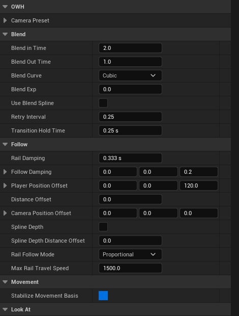

> *Пресет. Тот же набор настроек как дата-ассет: галочки здесь обычные, а не трёхпозиционные — трёхпозиционные живут на риге.*

`UOWH_CameraRigPreset` — дата-ассет с одним полем `Settings` типа
`FOWH_CameraSettings`. Эта же структура — то, на чём риг фактически работает:
`RefreshSettings()` складывает пресет и экземпляр в одно `Settings`, и весь
остальной код рига читает только его. Одно место, где пресет и экземпляр
примиряются, вместо двух списков, которые разъедутся.

- Числа: `Settings.X = Preset.X + Instance.X`, если пресет есть, иначе
  `Instance.X`. Именно поэтому назначение пресета обнуляет числа на экземпляре —
  иначе к пресету прибавились бы значения по умолчанию класса.
- Галочки: `EOWH_CameraToggle` — `Inherit` / `On` / `Off`. `Inherit` без пресета
  означает значение по умолчанию класса, поэтому риг без пресета ведёт себя
  ровно как раньше.
- Списки `EOWH_RailFollowMode` и `EOWH_BlendCurve` устроены так же: у обоих есть
  член `Inherit`. Внутри самого пресета `Inherit` читается как `Proportional` и
  `Cubic` соответственно.

`RefreshSettings()` зовётся на `BeginPlay`, в `OnConstruction` и из
`PostEditChangeProperty`. Если писать эти свойства из блюпринта в рантайме, его
надо позвать руками — он `BlueprintCallable`.

## 14. Репетиция в редакторе и панель камер

`Preview` включает у рига `ShouldTickIfViewportsOnly`, то есть он начинает
тикать в редакторе без PIE. На `PreviewPath` ставится болванка, и риг кадрирует
её ровно тем же кодом, которым кадрирует игрока: `UpdateFraming` один на оба
случая, поэтому предпросмотр и игра не могут разойтись.

**Репетиция ничего не двигает.** Компоненты рига — это данные уровня, и
сдвинутый компонент попал бы в сохранение. Поэтому кадр считается, снимается в
`PreviewCameraTransform`, а трансформ `Camera` возвращается
на место в том же кадре. `PreviewDistance`, `bPreviewAutoPlay` и `PreviewSpeed`
объявлены `Transient` — это скраббер, а не настройка.

Болванка и захват кадра созданы через `CreateEditorOnlyDefaultSubobject`: их нет
в собранной игре вообще.

Панель — нативный Slate (`SOWH_CameraPanel` в `OWHEditor`), а не Editor Utility
Widget. Причина процессная, не вкусовая: рабочий хост запускает редактор
headless, где блюпринтовый виджет нельзя ни собрать, ни проверить, а нативная
панель компилируется и проходит гейт как любой другой код.

**Картинка — это то, чем камера действительно снимает.** Капчуру отдаётся весь
`GetCameraView` компонента: filmback и фокусное как одно поле зрения, post
process целиком, а соотношение сторон — это форма самого рендер-таргета.
Копировать одно `FieldOfView`, как было раньше, значит показывать кадр, которого
камера не снимет: 16:9 текстура, которой отдали анаморфную камеру, сообщает
правильное число и показывает неправильную рамку.

**Болванку видно.** Она editor-only и `Hidden in Game` — обе вещи, по которым
сцен-капчур её пропускал, потому что рендерит по игровым правилам видимости. В
редакторском мире флаг снимается, в игровом остаётся; ставить её видимой на один
кадр, как делал филмстрип, больше не нужно.

### Композиция рисуется на кадре

`SOWH_CompositionOverlay` лежит поверх картинки: трети, точка кадра
(`Look At Screen Offset`) крестиком и мёртвая зона (`Look At Dead Zone`) рамкой.
Обе таскаются мышью, Shift на пустом месте вытягивает зону там, где её ещё нет,
и каждое перетаскивание — одна транзакция отмены на риге.

Единицы, чтобы оверлей и риг говорили об одном: точка кадра — доля **всего**
кадра от его середины, X вправо и Y вверх; мёртвая зона — доля всего кадра как
**полная** ширина и высота прямоугольника, поэтому 0.3 это три десятых кадра
поперёк.

### Вьюпорт одалживают, а не пилотируют

Кнопка «смотреть камерой» не ставит блокировку актора. Блокировка — это
пилотирование: полёт по вьюпорту записывается обратно в актор, и дизайнер,
забывший выйти, тащил вольюм по уровню; а выход любым путём, кроме кнопки самого
вьюпорта, оставлял вьюпорту объектив камеры.

Панель вместо этого **одалживает вид**: положение, поворот и FOV вьюпорта
прячутся на входе и отдаются на выходе, а вид камеры пишется каждый тик. Ничего
не заблокировано, поэтому двигать нечего; и раз вид переутверждается на следующем
тике, полёт даже не уводит дизайнера от кадра. Закрытие панели и смена камеры в
списке отпускают вьюпорт сами.

**У репетиции один выключатель.** `bPreview` пишется через одну функцию, которая
заодно перезапускает конструкционный скрипт, — и она же проходит по всем ригам,
которых панель касалась, когда панель закрывают. Флаг, записанный без
перезапуска, — это галочка, не согласная с уровнем: ровно то, из-за чего
апаратура оставалась стоять на уровне при снятой галке.

**Скорость прогона берёт знак.** Отрицательная гоняет болванку по пути в обратную
сторону — единственный способ увидеть кадр на обратном ходу, — и заворачивание
работает на обоих концах.

### Репетицию можно снять на плёнку

`CapturePreviewFrame` просит один кадр репетиции по имени, вместо того чтобы
ждать тика редактора. `TickPreview` решает только, *где* стоит болванка; всё
остальное — `PreviewFrameAt`, который зовут и тик, и скрипт, поэтому разойтись
они не могут.

Кадр берёт **скорость и дельту времени**, а не только дистанцию, и это не
формальность: мёртвая зона, сглаживание и упреждение зависят от движения, и
лента, снятая без них, показала бы кадр, которого игрок никогда не увидит.

`.scripts/ue/owh-127-filmstrip.py` проходит так все риги карты и выкладывает
кадры. Запускать **не коммандлетом** — иначе движок берёт Null RHI и кадры
чёрные:

```text
UnrealEditor-Cmd.exe OWH.uproject -RenderOffScreen -unattended -nop4 ^
    -nosplash -NoSound -ExecCmds="py .scripts/ue/owh-127-filmstrip.py, quit_editor"
```

Прогон ничего не сохраняет: карта открывается и оставляется, все трансформы
возвращаются в том же кадре.

## 15. Где что лежит

```
Content/Gameplay/Camera/
    BP_SidescrollerCameraRig         весь риг одним актором
    BP_SidescrollerCamera            камера
    BP_SidescrollerCameraRails       рельс
    BP_SidescrollerCameraSwitcher    переключатель
    Data/
        BP_SidescrollerCameraManager   PlayerCameraManager
        BPI_SidescrollerCameraManager  интерфейс
        ESidescrollerCameraMode        энум режимов
Content/Gameplay/Components01/
    AC_SidescrollerCameraConnector   вся логика
Content/Core/Libraries/
    BPFL_SidescrollerCameraHelpers   наведение слежения
Source/OWH/Public/Tools/OWH_CineCameraActor.h
Source/OWH/Private/Tools/OWH_CineCameraActor.cpp
Source/OWH/Public/Camera/OWH_SidescrollerCameraRig.h
Source/OWH/Private/Camera/OWH_SidescrollerCameraRig.cpp
Source/OWH/Public/Camera/OWH_CameraStatics.h        базис движения, сглаживание,
                                                   углы кадра, мёртвая зона
Source/OWH/Private/Camera/OWH_CameraStatics.cpp
Source/OWH/Public/Camera/OWH_CameraRigPreset.h     настройки, пресет, тумблеры
Source/OWH/Public/Camera/OWH_CameraLookAtVolume.h  вольюм и его подсистема
Source/OWH/Public/Camera/OWH_CameraDirectorSubsystem.h   стек кандидатов и часы
                                                   удержания — кто должен
                                                   показывать, на весь мир
Source/OWH/Private/Camera/OWH_CameraDirectorSubsystem.cpp
Source/OWH/Private/Camera/OWH_CameraLookAtVolume.cpp
Source/OWHEditor/Public/Camera/OWH_CameraPanel.h   панель OWH Cameras
Source/OWHEditor/Private/Camera/OWH_CameraPanel.cpp
```

В корне папки лежит только то, что ставится на уровень. Всё остальное —
менеджеры, интерфейсы, энумы — в `Data/`. Это общее правило проекта, а не
особенность камеры.

Примеры всех описанных случаев собраны на карте `L_Gameplay`.
